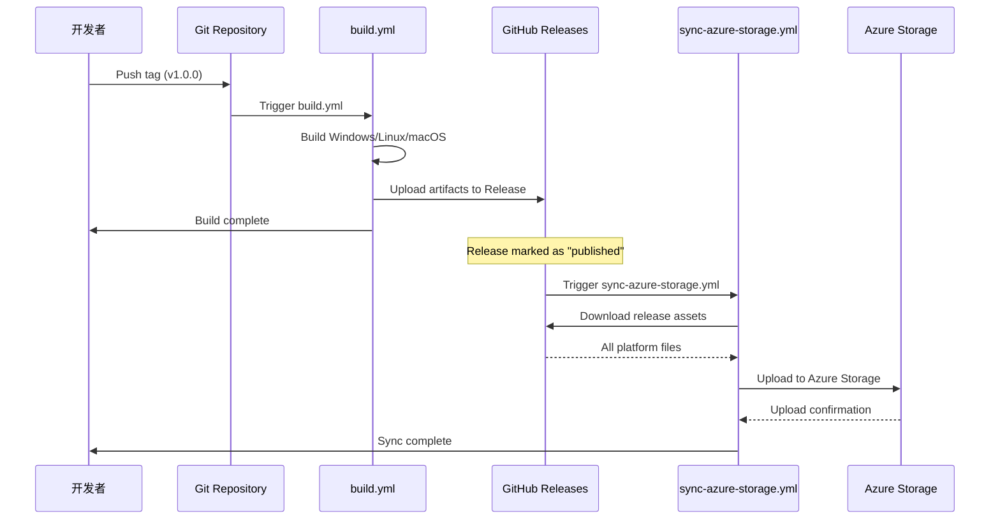
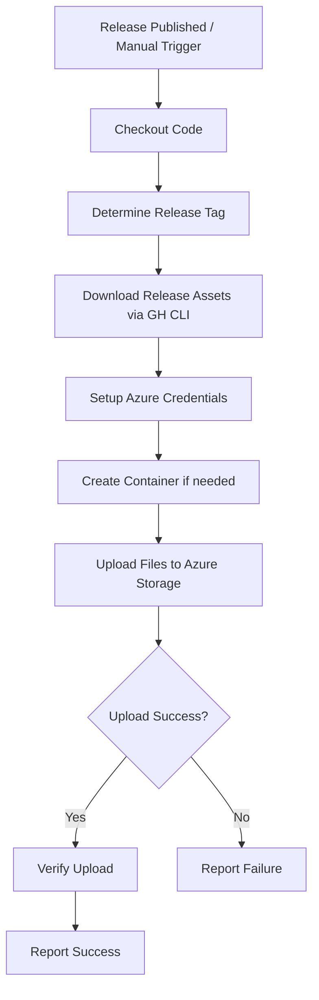
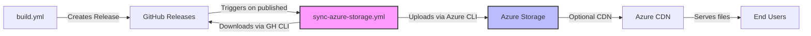
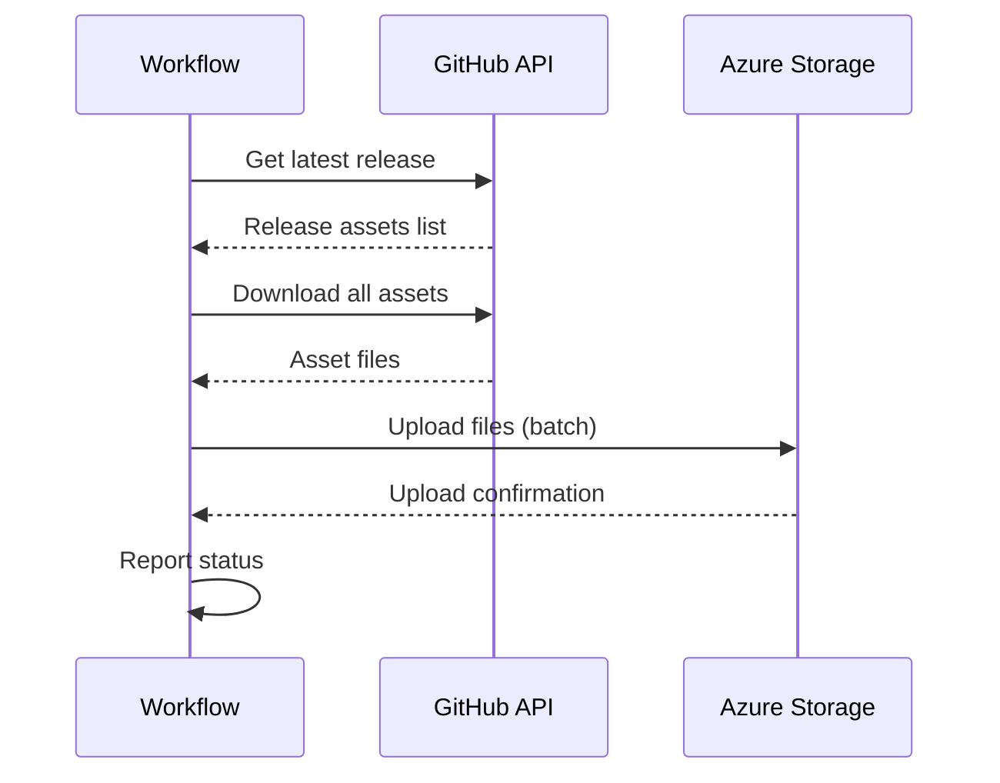

# Design: Azure Storage Release Sync

## Context

Hagicode Desktop 使用 electron-builder 构建跨平台应用，当前通过 GitHub Actions 自动化构建并发布到 GitHub Releases。此变更旨在建立文件分发管道，将发布文件同步到 Azure Storage 以支持 CDN 加速和冗余备份。

**约束条件**:
- 必须兼容现有的 build.yml 工作流
- 不能影响现有的发布流程
- 需要安全的 Azure 认证机制
- 支持多平台文件格式

**利益相关者**:
- 开发团队：维护和配置
- 最终用户：下载体验

## Goals / Non-Goals

**Goals**:
- 自动同步 release 文件到 Azure Storage
- 支持手动触发同步操作
- 安全的 Azure 认证
- 清晰的状态报告

**Non-Goals**:
- CDN 配置和优化（未来增强）
- 文件版本管理和清理
- 下载统计和分析
- 自动回滚机制

## Decisions

### Decision 1: 独立工作流 vs 扩展现有工作流

**选择**: 创建独立的 `sync-azure-storage.yml` 工作流

**理由**:
- 职责分离：构建和同步是不同的关注点
- 灵活性：可以独立触发和调试
- 安全性：不影响现有构建流程
- 可维护性：更容易理解和修改

**替代方案**:
- 在现有 build.yml 中添加同步步骤 → 被拒绝，会增加复杂度并延长构建时间

### Decision 2: 触发机制

**选择**: 使用 `release: types: [published]` + `workflow_dispatch`

**理由**:
- 自动触发：在 build.yml 完成后，当 release 被标记为 "published" 时自动执行
- 手动触发：支持重新同步或同步历史版本
- 符合 GitHub Actions 最佳实践
- 不与 build.yml 产生耦合或依赖关系

**工作流程说明**:
1. 当推送版本标签（如 `v1.0.0`）时，build.yml 被触发
2. build.yml 构建所有平台并上传文件到 GitHub Release
3. 当 release 被发布（从 draft/pre-release 变为 published）时，sync-azure-storage.yml 触发
4. sync-azure-storage.yml 下载所有 release 文件并上传到 Azure Storage

**替代方案**:
- 仅使用 `workflow_dispatch` → 被拒绝，自动化程度不足
- 使用 `push` tags → 被拒绝，可能在 release 创建前触发，导致文件不完整
- 使用 `workflow_run` → 被拒绝，增加复杂度且需要额外的权限配置

### Decision 3: 认证方式

**选择**: 使用 Azure Blob SAS URL 进行认证

**理由**:
- **简单性**: 只需配置一个 Secret，无需管理多个凭证
- **安全性**: SAS URL 有时间限制和权限限制，比长期密钥更安全
- **灵活性**: 可以随时撤销和重新生成 SAS URL
- **官方支持**: Azure CLI 原生支持 SAS token 认证

**SAS URL 格式**:
```
https://<account>.blob.core.windows.net/<container>?<sas-token>
```

**替代方案**:
- 使用连接字符串 → 被拒绝，需要两个 Secret（connection string 或 account + key）
- 使用账户密钥 → 被拒绝，安全风险更高，配置更复杂

### Decision 4: 索引文件生成

**选择**: 每次同步时自动生成 index.json

**理由**:
- **程序化访问**: JSON 格式便于应用和更新检查器消费
- **自动化**: 无需手动维护文件列表
- **可扩展性**: 包含文件元数据（大小、修改时间）
- **简单性**: 单一 JSON 文件，易于解析和使用

**索引文件结构**:
```json
{
  "updatedAt": "ISO 8601 timestamp",
  "versions": [
    {
      "version": "v1.0.0",
      "files": ["file1.exe", "file2.dmg", ...],
      "assets": [
        { "name": "...", "path": "...", "size": ..., "lastModified": "..." }
      ]
    }
  ]
}
```

**替代方案**:
- 生成 HTML 索引 → 被拒绝，可以通过前端使用 JSON 数据生成
- 不生成索引 → 被拒绝，用户难以发现和获取文件

### Decision 5: 文件下载方式

**选择**: 使用 `gh release download` CLI 命令

**理由**:
- 官方工具：GitHub CLI 是官方支持的工具
- 简单可靠：一行命令下载所有资产
- 无需 API Token 复杂配置

### 工作流执行顺序



### 工作流结构



### 组件关系



### 文件上传流程



## Configuration

### Required Secrets

| Secret Name | Description | Example |
|------------|-------------|---------|
| `AZURE_BLOB_SAS_URL` | Blob service SAS URL with Write permissions | `https://mystorageaccount.blob.core.windows.net/releases?sp=...` |

**SAS URL Requirements**:
- Must include Write permission
- Must include Create permission (for new blobs)
- Should include List permission (for verification)
- Set appropriate expiry date (recommended: 1+ year)

### SAS URL Generation

To generate a SAS URL:

1. Go to Azure Portal → Storage Account → Shared access signature
2. Configure:
   - Allowed services: Blob
   - Resource type: Container and Object
   - Permissions: Read, Write, Create, List
   - Start and expiry date: Set appropriate range
3. Generate and copy the "Blob service SAS URL"

**Format**:
```
https://<account>.blob.core.windows.net/<container>?sp=rwcl&st=2024-01-01&se=2025-01-01&sv=2021-01-01&sr=c&sig=...
```

### File Organization

Azure Storage 中的文件结构：
```
releases/
├── v1.0.0/
│   ├── Hagicode-Setup-1.0.0.exe
│   ├── Hagicode-1.0.0.dmg
│   └── Hagicode-1.0.0.AppImage
└── v1.1.0/
    ├── Hagicode-Setup-1.1.0.exe
    └── ...
```

## Risks / Trade-offs

### Risk 1: SAS Token 过期

**风险**: SAS Token 有有效期限制，到期后工作流会失败

**缓解措施**:
- 文档中明确说明需要设置合理的过期时间（建议 1 年以上）
- 工作流会检测认证失败并给出清晰的错误提示
- 可以轻松重新生成 SAS URL 并更新 Secret

### Risk 2: SAS Token 权限不足

**风险**: 如果 SAS Token 缺少 Write/Create 权限，上传会失败

**缓解措施**:
- 文档中明确说明所需的权限
- 工作流包含详细的错误提示
- 验证步骤会在上传后检查文件

### Risk 3: 同步失败未检测

**风险**: 工作流可能静默失败

**缓解措施**:
- 设置严格的失败条件 (`set -e`)
- 使用 `if: failure()` 步骤捕获错误
- 在工作流中添加验证步骤

### Trade-off: 简单性 vs 灵活性

**权衡**: 选择单一的 SAS URL 配置，放弃多种认证方式的支持

**理由**:
- SAS URL 是最简单、最安全的认证方式
- 减少配置复杂度和出错可能
- 大多数用户只需要一种认证方式
- 保留连接字符串作为文档中的备选方案

## Migration Plan

### Phase 1: 准备
1. 创建 Azure Storage Account
2. 创建 Blob 容器
3. 生成 Blob SAS URL（需要 Write、Create、List 权限）
4. 在 GitHub 中添加 `AZURE_BLOB_SAS_URL` Secret

### Phase 2: 实现
1. 创建工作流文件
2. 测试手动触发
3. 验证自动触发

### Phase 3: 验证
1. 检查文件完整性
2. 验证 CDN 访问
3. 监控工作流执行

### Rollback Plan

如果同步出现问题：
1. 删除或禁用 `sync-azure-storage.yml` 工作流
2. 删除 GitHub Secret（可选，清理凭证）
3. Azure Storage 中的文件保持不变（不自动删除）
4. GitHub Releases 继续正常工作
5. 无需回滚代码更改

## Open Questions

1. **是否需要支持增量同步？**
   - 当前设计：每次同步时重新上传所有文件
   - 未来考虑：可添加文件哈希检查，跳过已存在的文件

2. **是否需要支持多个容器？**
   - 当前设计：使用单一容器，按版本组织
   - 未来考虑：可按平台或文件类型使用不同容器

3. **是否需要自动清理旧版本？**
   - 当前设计：保留所有历史版本
   - 未来考虑：可配置保留策略（如保留最近 N 个版本）

4. **是否需要 CDN 集成？**
   - 当前设计：仅上传文件，CDN 配置单独管理
   - 未来考虑：可添加 CDN 缓存清除步骤
