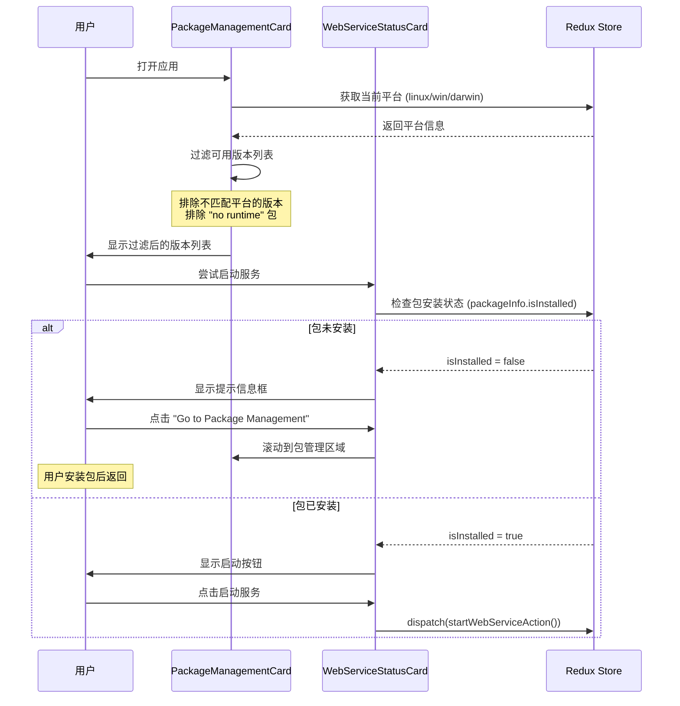
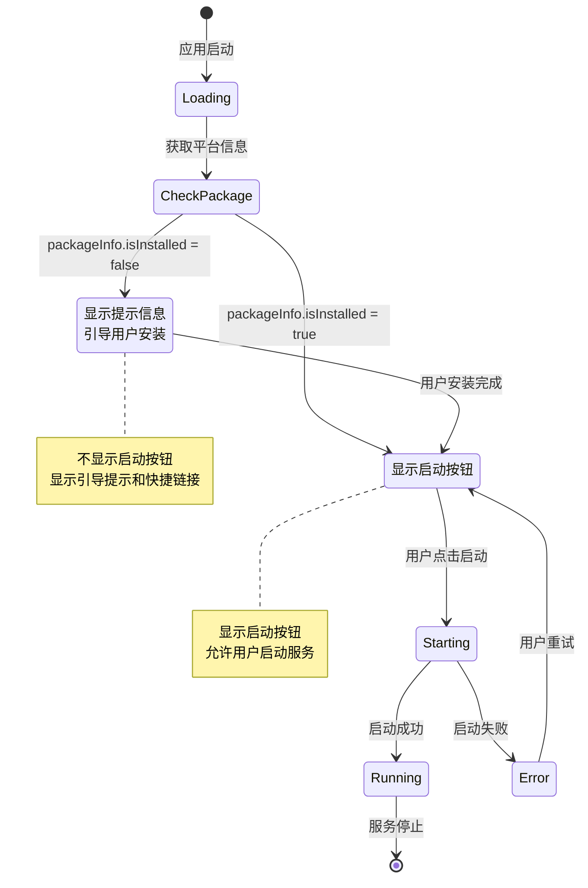
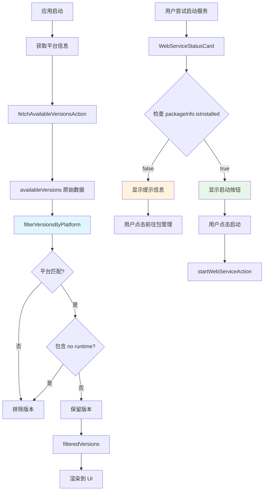

# Change: 包管理和服务启动 UX 优化

## Why

当前 Electron 桌面应用中的包管理和 Web 服务启动功能存在两个关键用户体验问题：

1. **包版本过滤不完整**：版本下拉列表显示所有可用版本，未根据当前平台进行过滤，用户可能选择不兼容的包版本（如 Linux 系统显示 Windows 版本或 "no runtime" 包）
2. **服务启动按钮显示逻辑不当**：无论服务是否已安装，始终显示"启动服务"按钮，用户在服务未安装时点击启动会导致错误或无效操作

这些缺陷增加了用户操作错误的风险，降低了应用的易用性和专业度。

## What Changes

- **平台感知的包版本过滤**：在 `PackageManagementCard` 组件中实现基于当前平台的版本过滤，排除不兼容版本和 "no runtime" 包
- **安装前检测的服务启动控制**：在 `WebServiceStatusCard` 组件中检查包安装状态，在包未安装时显示提示信息而非启动按钮
- **改进的状态反馈**：为用户提供清晰的操作引导和状态提示

## UI 设计变更

### 1. 版本选择界面变更

**当前状态**：
```
┌─────────────────────────────────────────────────────────────┐
│ Package Management                             [Package]     │
├─────────────────────────────────────────────────────────────┤
│                                                             │
│ Platform:         linux                                      │
│                                                             │
│ ───────────────────────────────────────────────────────────│
│                                                             │
│ Installation Status    Installed Version                    │
│ ✓ Installed            1.0.0-linux-x64                     │
│                                                             │
│ ───────────────────────────────────────────────────────────│
│                                                             │
│ Select Version to Install:                                  │
│ ┌─────────────────────────────────────────────────────────┐ │
│ │ -- Select a version --                                  │ │
│ └─────────────────────────────────────────────────────────┘ │
│     [显示所有版本 - linux, win, mac, no runtime...]         │
│                                                             │
│ [Install Package]                   [🔄]                   │
│                                                             │
│ Available versions: 12 found                                │
└─────────────────────────────────────────────────────────────┘
```

**优化后状态**：
```
┌─────────────────────────────────────────────────────────────┐
│ Package Management                             [Package]     │
├─────────────────────────────────────────────────────────────┤
│                                                             │
│ Platform:         linux                                      │
│                                                             │
│ ───────────────────────────────────────────────────────────│
│                                                             │
│ Installation Status    Installed Version                    │
│ ✓ Installed            1.0.0-linux-x64                     │
│                                                             │
│ ───────────────────────────────────────────────────────────│
│                                                             │
│ Select Version to Install:                                  │
│ ┌─────────────────────────────────────────────────────────┐ │
│ │ -- Select a version --                                  │ │
│ │ 1.0.1-linux-x64          ✓ Platform matched             │ │
│ │ 1.0.0-linux-x64          ✓ Platform matched             │ │
│ └─────────────────────────────────────────────────────────┘ │
│     [仅显示 linux 平台版本，排除 no runtime 包]              │
│                                                             │
│ [Install Package]                   [🔄]                   │
│                                                             │
│ Available versions: 5 found (filtered by platform: linux)  │
└─────────────────────────────────────────────────────────────┘
```

### 2. 服务启动界面变更

**当前状态**：
```
┌─────────────────────────────────────────────────────────────┐
│ Embedded Web Service                              [Server]   │
├─────────────────────────────────────────────────────────────┤
│                                                             │
│ Status:  Stopped                                             │
│                                                             │
│ [▶ Start Service]                                            │
│                                                             │
│ ───────────────────────────────────────────────────────────│
└─────────────────────────────────────────────────────────────┘
```

**优化后状态（包未安装时）**：
```
┌─────────────────────────────────────────────────────────────┐
│ Embedded Web Service                              [Server]   │
├─────────────────────────────────────────────────────────────┤
│                                                             │
│ Status:  Stopped                                             │
│                                                             │
│ ┌─────────────────────────────────────────────────────────┐ │
│ │ ℹ Package not installed                                 │ │
│ │                                                         │ │
│ │ The web service package is not installed yet.           │ │
│ │ Please install the package first from the "Package      │ │
│ │ Management" section above, then return here to start    │ │
│ │ the service.                                            │ │
│ │                                                         │ │
│ │ [Go to Package Management]                               │ │
│ └─────────────────────────────────────────────────────────┘ │
│                                                             │
│ ───────────────────────────────────────────────────────────│
└─────────────────────────────────────────────────────────────┘
```

**优化后状态（包已安装时）**：
```
┌─────────────────────────────────────────────────────────────┐
│ Embedded Web Service                              [Server]   │
├─────────────────────────────────────────────────────────────┤
│                                                             │
│ Status:  Stopped                                             │
│                                                             │
│ [▶ Start Service]                                            │
│                                                             │
│ ───────────────────────────────────────────────────────────│
└─────────────────────────────────────────────────────────────┘
```

### 用户交互流程



### 状态转换图



## 代码流程变更

### 数据流变更



### 组件交互图

```mermaid
graph TD
    subgraph "Redux Store"
        Store[webServiceSlice]
        PlatformState[platform: string]
        VersionsState[availableVersions: string[]]
        PackageInfo[packageInfo: PackageInfo]
    end

    subgraph "UI Components"
        PMC[PackageManagementCard]
        WSC[WebServiceStatusCard]
    end

    subgraph "过滤逻辑"
        Filter[filterVersionsByPlatform]
        Check{检查版本名称}
    end

    PMC -->|useSelector| PlatformState
    PMC -->|useSelector| VersionsState
    PMC --> Filter
    Filter --> Check
    Check -->|包含平台名称| VersionsState
    Check -->|不包含 no runtime| VersionsState

    WSC -->|useSelector| PackageInfo
    PackageInfo -->|isInstalled: false| Alert[显示 Alert 提示]
    PackageInfo -->|isInstalled: true| Button[显示启动按钮]

    style Filter fill:#bbdefb
    style Alert fill:#ffccbc
    style Button fill:#c8e6c9
```

### 代码变更清单

| 文件路径 | 变更类型 | 变更原因 | 影响范围 |
|---------|---------|---------|---------|
| `src/renderer/components/PackageManagementCard.tsx` | 新增函数 | 实现 `filterVersionsByPlatform` 函数进行平台和运行时过滤 | 版本选择逻辑 |
| `src/renderer/components/PackageManagementCard.tsx` | UI修改 | 使用过滤后的版本列表替换原始列表，更新版本统计文本 | 版本下拉列表 |
| `src/renderer/components/WebServiceStatusCard.tsx` | 新增导入 | 导入 `selectPackageManagementInfo` 选择器 | 状态获取 |
| `src/renderer/components/WebServiceStatusCard.tsx` | 新增逻辑 | 获取包安装状态并用于条件渲染 | 按钮显示逻辑 |
| `src/renderer/components/WebServiceStatusCard.tsx` | UI修改 | 在包未安装时显示 Alert 提示而非启动按钮 | 主界面布局 |

### 详细变更 - PackageManagementCard.tsx

| 函数/组件 | 变更类型 | 具体变更 | 变更原因 |
|----------|---------|---------|---------|
| filterVersionsByPlatform | 新增函数 | 接收版本数组和平台字符串，返回过滤后的数组 | 实现平台感知过滤 |
| SelectContent 渲染 | 修改 | 从 `availableVersions.map` 改为 `filteredVersions.map` | 使用过滤后的列表 |
| 版本统计文本 | 修改 | 显示过滤后版本数量和平台信息 | 提供透明反馈 |

### 详细变更 - WebServiceStatusCard.tsx

| 函数/组件 | 变更类型 | 具体变更 | 变更原因 |
|----------|---------|---------|---------|
| useSelector(selectPackageManagementInfo) | 新增 | 获取包安装状态 | 检查是否已安装 |
| isStopped 条件渲染 | 修改 | 添加 `packageInfo?.isInstalled` 判断 | 条件显示按钮或提示 |
| Alert 组件 | 新增 | 在包未安装时显示引导信息 | 改善用户体验 |

## Impact

### 影响的规范
- `specs/electron-app/spec.md` - 修改包管理和服务启动相关需求

### 影响的代码
- **前端组件**：
  - `src/renderer/components/PackageManagementCard.tsx:178-184` - 版本列表渲染
  - `src/renderer/components/WebServiceStatusCard.tsx:173-191` - 启动按钮显示逻辑
- **Redux 状态**（无需修改，已有足够状态）：
  - `webServiceSlice.platform` - 当前平台
  - `webServiceSlice.availableVersions` - 可用版本列表
  - `webServiceSlice.packageInfo.isInstalled` - 包安装状态

### 用户体验改善
- ✅ 降低操作错误 - 用户只能看到和选择与其系统兼容的包版本
- ✅ 清晰的操作引导 - 明确提示用户需要先安装包才能启动服务
- ✅ 减少困惑 - 避免尝试安装不兼容包导致的失败
- ✅ 提高专业度 - 应用更加智能地处理平台差异

### 技术影响
- ✅ 无需修改 Redux store 结构 - 现有状态已足够支持
- ✅ 向后兼容 - 已安装的服务不受影响
- ✅ 纯前端变更 - 不涉及后端或 IPC 通信
- ✅ 易于测试 - 可在不同平台版本数据下验证过滤逻辑

### 风险评估
- 🟡 **低风险** - 变更局限于 UI 层逻辑，不涉及数据持久化或核心业务逻辑
- 🟡 **测试需求** - 需要准备不同平台的版本名称测试用例以确保过滤逻辑正确
- 🟢 **回滚简单** - 如有问题可快速回滚到原始实现

## 非目标 (Non-Goals)
- 不修改版本数据的获取逻辑（仍从文件系统扫描）
- 不改变包安装的核心流程
- 不修改服务的启动/停止/重启逻辑
- 不添加版本兼容性检查的 UI 配置选项
- 不处理多架构平台（如 ARM vs x86）的复杂情况
