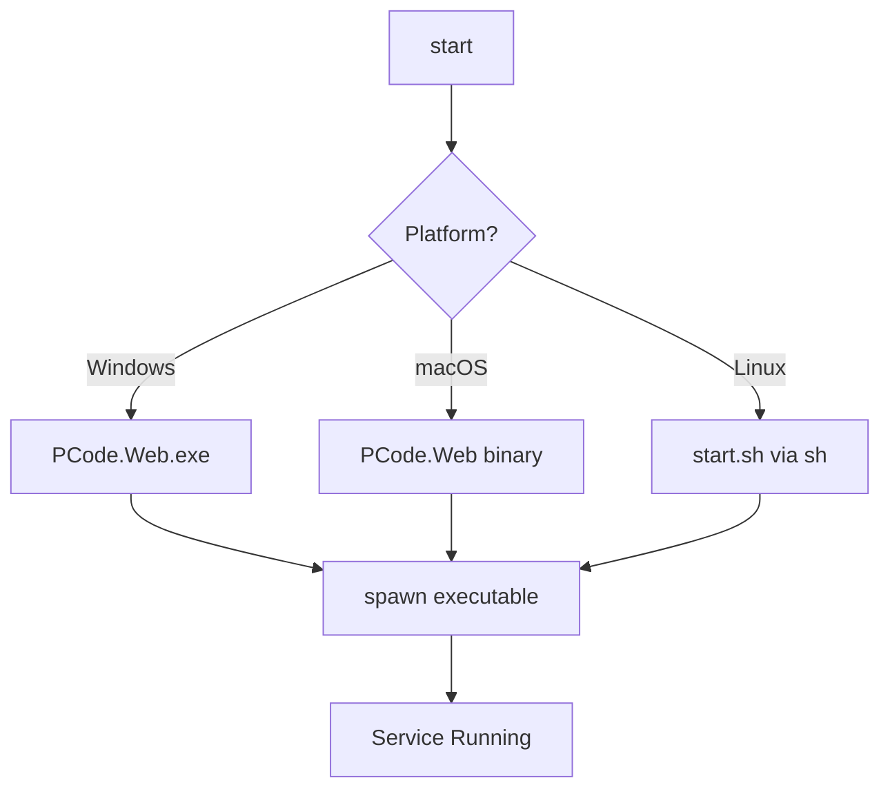
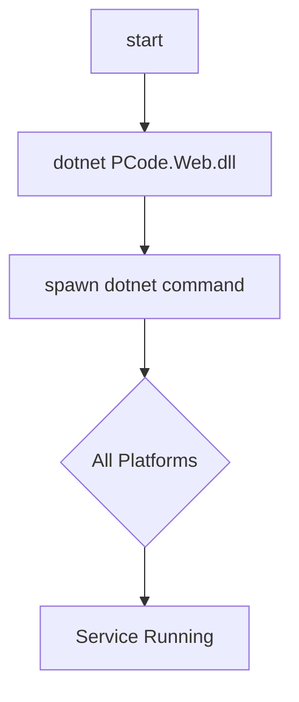
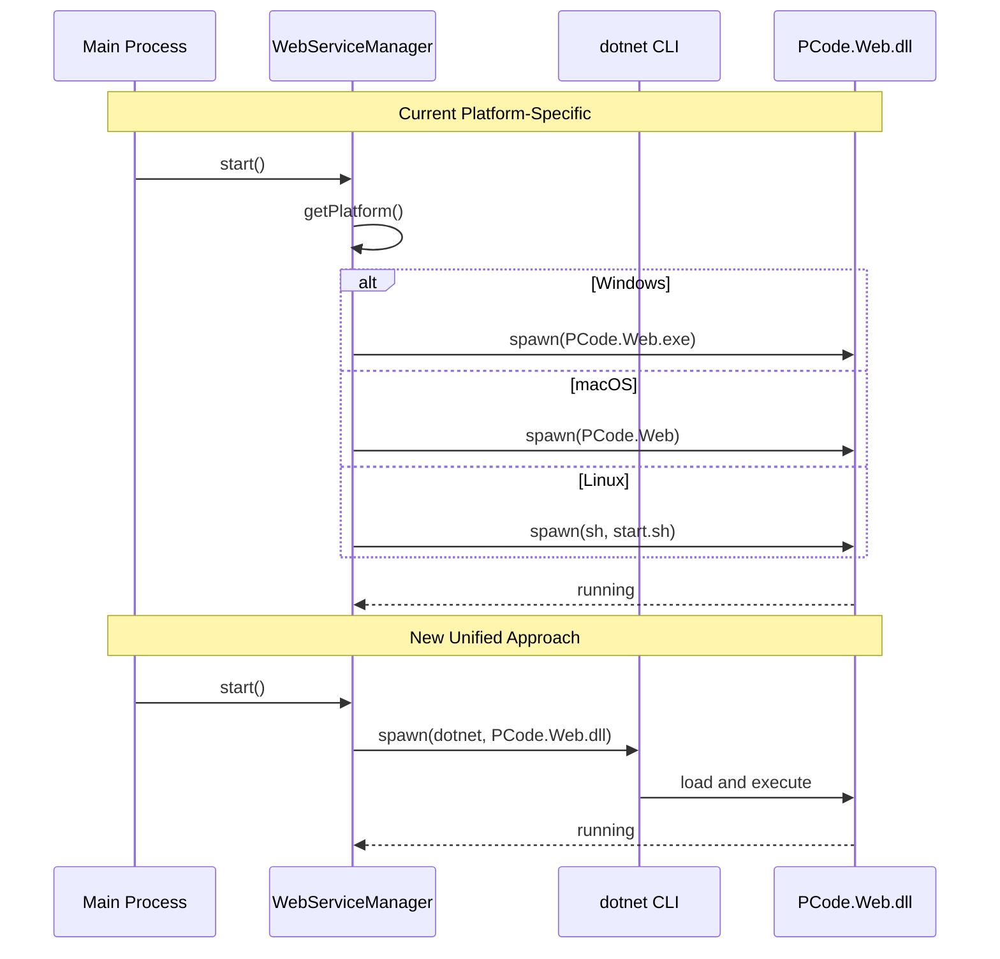

# Change: Unified dotnet Command for Web Service Startup

## Why

The current implementation uses different startup methods across platforms:
- **Windows**: Directly executes `PCode.Web.exe`
- **macOS**: Directly executes `PCode.Web` binary
- **Linux**: Executes `start.sh` shell script

This creates:
1. **Cross-platform inconsistency** - Different code paths for each platform
2. **Maintenance complexity** - Platform-specific logic to maintain
3. **Non-standard approach** - Not following .NET cross-platform best practices

The .NET Runtime 8.0 is already embedded in the application package. Using the `dotnet` command to start the service is the recommended cross-platform approach.

## What Changes

- Modify `WebServiceManager.getSpawnCommand()` to use `dotnet` command on all platforms
- Update `WebServiceManager.getExecutablePath()` to return the DLL path instead of platform-specific executables
- Adjust `WebServiceManager.getSpawnOptions()` for dotnet spawn behavior
- Ensure the embedded .NET Runtime is properly utilized
- Update error handling and process management for dotnet-specific behavior
- Remove platform-specific shell script execution (start.sh)

## UI Design Changes

None - This is a backend change that does not affect the UI.

## Code Flow Changes

### Before (Current Flow)

### After (New Flow)

### Startup Sequence Comparison

## Impact

- **Affected specs**: `electron-app` (embedded web service startup behavior)
- **Affected code**:
  - `src/main/web-service-manager.ts:83-187` (getExecutablePath, getSpawnCommand methods)
  - `src/main/web-service-manager.ts:142-161` (getSpawnOptions method)
  - Path handling for web service executables

## Benefits

- **Cross-platform consistency** - Same startup method across all platforms
- **Simplified code** - Remove platform-specific branching logic
- **.NET best practices** - Using dotnet CLI as recommended
- **Easier debugging** - dotnet CLI provides consistent error messages
- **Future-proof** - Aligns with .NET ecosystem standards

## Risks & Mitigations

| Risk | Mitigation |
|------|------------|
| dotnet command not in PATH | Bundle dotnet runtime with app; use absolute path |
| Performance difference | Minimal overhead; consistent across platforms |
| Existing user installations | Handle fallback gracefully during transition |

## Success Criteria

1. All three platforms (Windows, macOS, Linux) use `dotnet PCode.Web.dll` command
2. Service starts successfully on all platforms
3. No regression in startup time or reliability
4. Error messages remain clear and actionable
5. All existing tests pass
