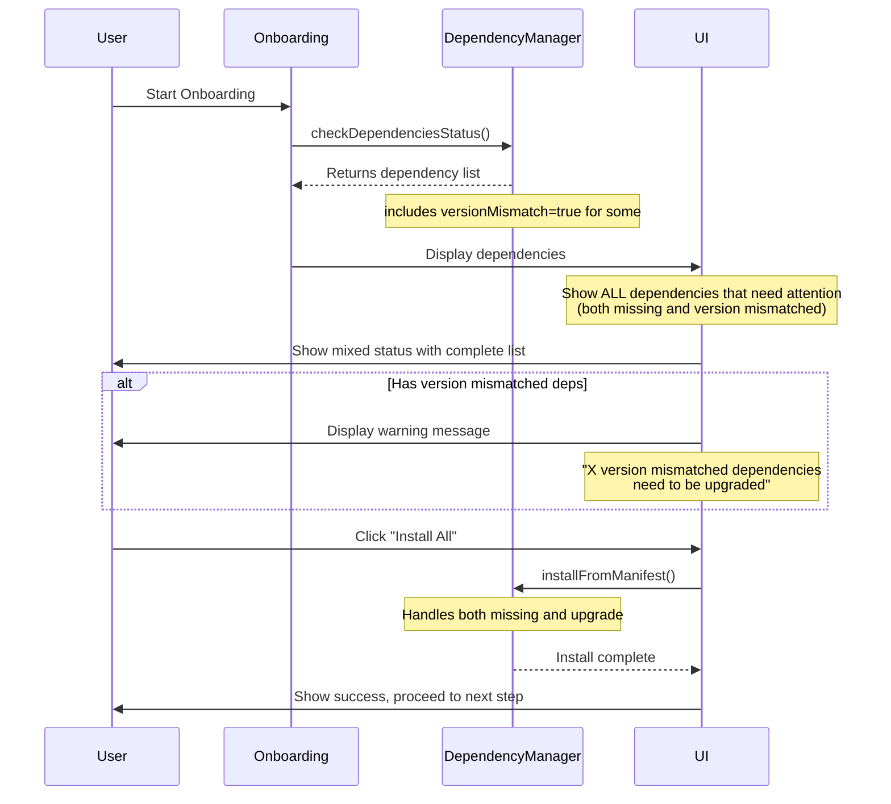

# Proposal: 引导流程处理依赖版本不匹配

## Change ID
`onboarding-dependency-version-mismatch-handling`

## Status
**ExecutionCompleted**

## Overview
首次使用引导流程需要正确处理依赖版本不匹配的情况，确保用户在完成引导前所有依赖（包括版本不匹配的）都被正确识别并安装/升级。

**核心原则**：引导流程必须一次性显示所有需要处理的依赖（缺失和版本不匹配），不能只显示第一个问题或逐步暴露问题。用户应该能够看到完整的依赖状态，并在一键操作中修复所有问题。

## Context

### 当前实现分析
引导流程（Onboarding）在 `src/main/onboarding-manager.ts` 中实现，负责管理首次用户引导流程，包括：
1. 欢迎介绍
2. 包下载
3. **依赖安装** - 当前问题所在
4. 服务启动

### 依赖状态类型
`DependencyManager.checkSystemDependencies()` 返回的依赖状态包括：
- `installed: true, versionMismatch: false` - 依赖已正确安装
- `installed: false, versionMismatch: false` - 依赖完全缺失
- `installed: true, versionMismatch: true` - **依赖已安装但版本不匹配**

### 问题代码位置
在 `src/main/onboarding-manager.ts` 的 `installDependencies()` 方法中（第 304-306 行）：

```typescript
// Filter missing dependencies
const missingDeps = dependencies.filter(dep => {
  const checkResult = initialStatus.find(r => r.name === dep.name);
  return !checkResult || !checkResult.installed || checkResult.versionMismatch;
});
```

**注意**：此代码已经正确地将 `versionMismatch` 包含在过滤条件中。然而，在 `DependencyManagementCardUnified.tsx` 中，存在不一致的处理。

### UI 组件问题
在 `src/renderer/components/DependencyManagementCardUnified.tsx` 中：
- 第 81 行：`dependencies.filter(dep => !dep.installed || dep.versionMismatch)` - 正确过滤
- 第 54 行：`dependencies.every(dep => dep.installed && !dep.versionMismatch)` - 正确检测完成条件

## Problem Statement

### 核心问题
虽然代码中已经考虑了 `versionMismatch` 状态，但存在以下用户体验问题：

1. **用户界面提示不够明确**：
   - 版本不匹配的依赖与完全缺失的依赖显示方式相同
   - 用户不清楚需要升级而非全新安装

2. **引导流程完整性**：
   - 用户可能在完成引导后发现服务无法启动
   - 违背了引导流程"确保系统就绪"的设计初衷
   - **关键**：向导必须一次性展示所有需要处理的依赖（缺失和版本不匹配），不能逐步暴露问题

3. **国际化支持不完整**：
   - 缺少针对版本不匹配场景的专门文案
   - 用户无法清楚了解"版本不匹配"与"未安装"的区别

### 关键用户场景
**问题场景**：用户系统中同时存在多个依赖问题
- 依赖 A：完全缺失
- 依赖 B：版本不匹配
- 依赖 C：版本不匹配

**当前问题**：如果只显示第一个问题，用户需要多次操作才能发现和解决所有问题，这违背了引导流程"一次性配置完成"的设计初衷。

**预期行为**：引导流程应该同时显示所有 3 个问题，用户可以一次性处理所有依赖，或选择逐个处理。

### 受影响的功能模块
- **引导流程依赖检查步骤** (`src/main/onboarding-manager.ts`)
- **依赖管理卡片组件** (`src/renderer/components/DependencyManagementCardUnified.tsx`)
- **引导依赖安装步骤** (`src/renderer/components/onboarding/steps/DependencyInstaller.tsx`)
- **国际化文件** (`src/renderer/i18n/locales/*/onboarding.json`)

## Proposed Solution

### 核心策略
在引导流程上下文中，将 `versionMismatch` 视为需要修复的依赖状态，但提供更清晰的区分和说明。

**关键要求**：向导必须一次性展示所有需要处理的依赖（包括缺失和版本不匹配），而不是只展示第一个问题或逐步暴露问题。

### 实施方案

#### 1. UI 状态显示优化
在依赖管理卡片中区分显示两种状态：
- **未安装**：红色 × 图标，"未安装"状态
- **版本不匹配**：黄色 ⚠️ 图标，"版本不匹配"状态，显示当前版本 vs 要求版本

#### 2. 用户引导文案增强
添加版本不匹配的说明信息：
- 明确告知用户版本不匹配也需要处理
- 说明可能的影响（服务无法启动）
- 提供升级操作的说明

#### 3. 修复流程统一
对缺失和版本不匹配的依赖使用相同的安装/修复流程：
- `installSingleDependency()` 方法可以处理版本升级场景
- `DependencyManager.installFromManifest()` 已支持安装指定版本

**关键验证点**：确保在引导流程中，所有需要处理的依赖（包括缺失和版本不匹配）都被正确过滤并显示，没有任何遗漏。

### 代码修改清单

#### 修改 1: UI 文案增强
在 `src/renderer/i18n/locales/` 中添加版本不匹配的说明：

**en-US/onboarding.json**:
```json
"depInstallConfirm": {
  "versionMismatchNote": "Some dependencies have incorrect versions and need to be upgraded.",
  "mixedMissingMessage": "Detected {{missing}} missing and {{mismatch}} version mismatch dependencies"
}
```

**zh-CN/onboarding.json**:
```json
"depInstallConfirm": {
  "versionMismatchNote": "部分依赖版本不正确，需要升级。",
  "mixedMissingMessage": "检测到 {{missing}} 个缺失和 {{mismatch}} 个版本不匹配的依赖"
}
```

#### 修改 2: 依赖管理卡片提示优化
在 `DependencyManagementCardUnified.tsx` 中：
- 统计缺失和版本不匹配的依赖数量
- 在一键安装区域显示更准确的提示信息
- 添加版本不匹配的说明文案

#### 修改 3: 安装按钮文案优化
区分显示安装操作：
- 完全缺失：显示"安装"
- 版本不匹配：显示"升级"或"修复"

## UI Design Changes

### 依赖卡片显示优化

```
┌─────────────────────────────────────────────────────────┐
│ Install System Dependencies                             │
│                                                         │
│ Check the installation status of system dependencies   │
└─────────────────────────────────────────────────────────┘

┌─────────────────────────────────────────────────────────┐
│ ✅ .NET Runtime (ASP.NET Core)                          │
│    Installed                                            │
│    Current Version: 8.0.11                              │
└─────────────────────────────────────────────────────────┘

┌─────────────────────────────────────────────────────────┐
│ ⚠️  OpenSpec CLI                                        │
│    Version Mismatch                                     │
│    Current Version: 0.22.0                              │
│    Required Version: 0.23.0                             │
│    Specification-driven development framework           │
│    [Upgrade]                                            │
└─────────────────────────────────────────────────────────┘

┌─────────────────────────────────────────────────────────┐
│ ❌ Claude Code CLI                                      │
│    Not Installed                                        │
│    AI-powered development assistant                     │
│    [Install]                                            │
└─────────────────────────────────────────────────────────┘

┌─────────────────────────────────────────────────────────┐
│ ⚠️  Dependencies need attention                         │
│                                                         │
│ Detected 1 missing and 1 version mismatch dependency.  │
│ Version mismatched dependencies will be upgraded to    │
│ the required version automatically.                    │
│                                                         │
│ [Install All Dependencies]                              │
└─────────────────────────────────────────────────────────┘
```

### 用户交互流程



## Impact Assessment

### 技术影响
| 文件 | 修改类型 | 复杂度 |
|------|----------|--------|
| `src/renderer/components/DependencyManagementCardUnified.tsx` | UI 增强 | 低 |
| `src/renderer/i18n/locales/en-US/onboarding.json` | 文案添加 | 低 |
| `src/renderer/i18n/locales/zh-CN/onboarding.json` | 文案添加 | 低 |
| `src/renderer/components/onboarding/steps/DependencyInstaller.tsx` | 无需修改 | - |

### 兼容性影响
- **向后兼容**：是，不改变现有 API 和数据结构
- **数据结构**：`DependencyCheckResult` 已包含 `versionMismatch` 字段
- **API 签名**：无需修改任何方法签名

### 用户体验改进
1. **清晰度**：用户能清楚区分"缺失"和"版本不匹配"
2. **信任度**：版本不匹配被明确识别并提示处理
3. **完整性**：确保引导完成后系统真正就绪

### 风险评估
| 风险 | 可能性 | 影响 | 缓解措施 |
|------|--------|------|----------|
| 版本升级失败 | 中 | 中 | 依赖管理器已支持重试和错误处理 |
| 用户混淆"升级"和"安装" | 低 | 低 | 清晰的文案和图标区分 |
| 国际化翻译遗漏 | 低 | 低 | 代码审查时检查所有语言文件 |

## Scope

### 包含的更改
- UI 文案增强，区分"缺失"和"版本不匹配"
- 一键安装按钮提示信息优化
- 添加版本不匹配说明文案
- 国际化文件更新（中英文）

### 不包含的更改
- `DependencyManager` 逻辑修改（已支持版本升级）
- `OnboardingManager` 核心逻辑修改（已正确处理）
- 新的 API 或数据结构

## Success Criteria

1. **功能完整性**
   - [ ] 版本不匹配的依赖在引导流程中被正确识别
   - [ ] 用户能看到版本不匹配与缺失的区别
   - [ ] 安装/升级操作能正确执行
   - [ ] **所有需要处理的依赖一次性展示，无遗漏**

2. **用户体验**
   - [ ] UI 文案清晰说明版本不匹配的情况
   - [ ] 一键安装按钮显示准确的依赖数量
   - [ ] 完成安装后所有依赖都满足版本要求

3. **国际化**
   - [ ] 中英文文案都包含版本不匹配说明
   - [ ] 复数形式处理正确（1 个 vs 多个）

4. **测试验证**
   - [ ] 版本不匹配场景测试通过
   - [ ] 混合场景（部分缺失+部分不匹配）测试通过
   - [ ] 跨平台测试通过

## Alternatives Considered

### 方案 A：不区分版本不匹配
- **优点**：实现简单，无需修改代码
- **缺点**：用户体验差，不清楚问题根源
- **结论**：不采纳，违背引导流程设计初衷

### 方案 B：强制要求所有依赖完全匹配才能继续
- **优点**：确保系统完全就绪
- **缺点**：可能过于严格，影响用户灵活性
- **结论**：当前方案已平衡，允许用户看到所有问题

### 选定方案：识别并提示，统一修复流程
- **优点**：清晰、用户友好、技术实现简单
- **结论**：采纳

## Related Issues
无

## References
- `specs/dependency-management/spec.md` - 依赖管理核心规范
- `src/main/onboarding-manager.ts:304-306` - 依赖过滤逻辑
- `src/renderer/components/DependencyManagementCardUnified.tsx:54-84` - UI 组件实现
