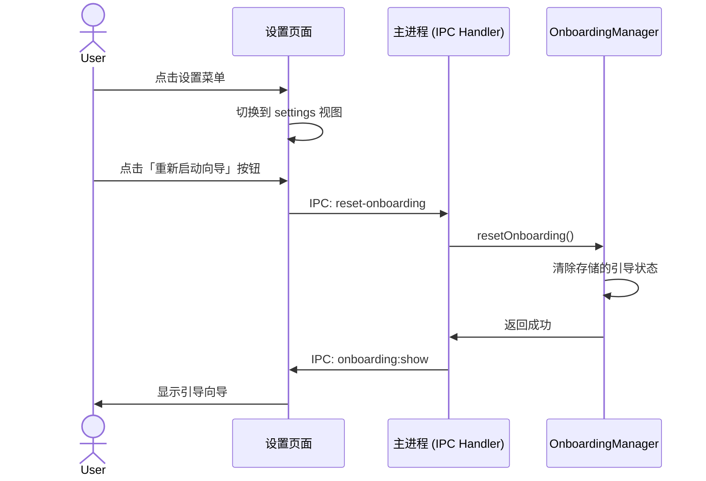
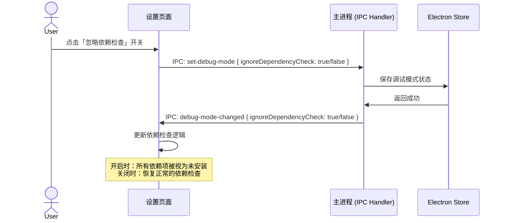

# Change: 添加设置页面和启动向导重置功能

## Why

Hagicode Desktop 当前缺少一个集中的设置界面来管理应用级配置和系统级选项。用户需要重新运行引导向导来进行调试或重新配置，但缺乏便捷的入口点来触发此操作。添加设置页面将提供统一的应用配置管理位置，改善用户体验和可维护性。

## What Changes

- **新增一级导航菜单「设置」**：在侧边栏导航中添加设置菜单项，使用 Settings 图标
- **新增设置视图类型**：在 `ViewType` 中添加 `'settings'` 类型
- **创建设置页面组件**：使用 Radix UI 的 Tabs 组件实现垂直布局
- **添加启动向导设置项**：提供「重新启动向导」按钮，调用 `OnboardingManager.resetOnboarding()` 方法
- **添加调试模式开关**：提供「忽略依赖检查」调试开关，开启时将所有依赖项视为未安装状态，便于测试未安装状态下的页面行为
- **添加 IPC 通信**：添加 `reset-onboarding` 和 `set-debug-mode` IPC 处理器
- **国际化支持**：在中文和英文翻译文件中添加相关翻译键

## UI Design Changes

### 侧边栏新增设置菜单项

```
┌─────────────────────────────────────┐
│ Hagico                              │
├─────────────────────────────────────┤
│ ⚙️ 仪表盘                           │
│ 📄 版本管理                         │
│ 🔑 许可证管理                       │
│ ⚙️ 设置                [NEW]        │  <-- NEW
├─────────────────────────────────────┤
│ 🌐 官方网站                         │
│ 👥 加入技术支持群                   │
│ ⭐ 为项目点赞👍                     │
└─────────────────────────────────────┘
```

### 设置页面布局

```
┌─────────────────────────────────────────────────────────────┐
│ 设置                                                        │
├──────────────┬──────────────────────────────────────────────┤
│              │                                              │
│ 启动向导     │  启动向导                                     │
│              │                                              │
│              │  重新运行首次使用引导流程，重新配置数据目录、   │
│              │  下载包、安装依赖并启动服务。                 │
│              │                                              │
│              │  ┌────────────────────────────────────────┐ │
│              │  │  🔄 重新启动向导                       │ │
│              │  └────────────────────────────────────────┘ │
│              │                                              │
│ 调试         │  调试                       [NEW]           │
│              │                                              │
│              │  忽略依赖检查                                 │
│              │  开启后所有依赖项将被视为未安装，用于测试未    │
│              │  安装状态下的页面行为。                       │
│              │                                              │
│              │  ┌────────┐                                   │
│              │  │  🔄 关闭│     [Switch]                    │
│              │  └────────┘                                   │
│              │                                              │
└──────────────┴──────────────────────────────────────────────┘
```

### 用户交互流程



### 调试模式交互流程



## Impact

### 影响的规范 (Affected Specs)
- `electron-app` - 添加设置页面和启动向导重置功能

### 影响的代码 (Affected Code)

**新增文件：**
- `src/renderer/components/SettingsPage.tsx` - 设置页面主组件
- `src/renderer/components/settings/OnboardingSettings.tsx` - 启动向导设置子组件
- `src/renderer/components/settings/DebugSettings.tsx` - 调试设置子组件 [NEW]

**修改文件：**
- `src/renderer/components/SidebarNavigation.tsx` - 添加设置导航项
- `src/renderer/store/slices/viewSlice.ts` - 添加 `settings` 视图类型
- `src/renderer/App.tsx` - 添加 settings 视图渲染
- `src/main/main.ts` - 添加 reset-onboarding 和 set-debug-mode IPC 处理器
- `src/renderer/i18n/locales/zh-CN/common.json` - 添加中文翻译
- `src/renderer/i18n/locales/en-US/common.json` - 添加英文翻译
- `src/renderer/i18n/locales/zh-CN/pages.json` - 添加页面中文翻译
- `src/renderer/i18n/locales/en-US/pages.json` - 添加页面英文翻译
- 依赖检查相关逻辑 - 修改以支持调试模式下的忽略检查 [NEW]

### 用户体验影响
- 提供统一的设置入口，提升应用的可发现性和可用性
- 便于开发者和用户重新触发引导流程进行调试和重新配置
- 调试模式开关允许开发者在未安装状态下测试页面行为，提升开发和测试效率
- 垂直 Tabs 布局为未来添加更多设置类别（如语言、主题、网络配置等）提供了清晰的扩展路径

### 向后兼容性
- 此变更为纯新增功能，不影响现有功能
- 现有用户的应用不会受到影响
- 引导状态重置操作需要用户主动触发

## Success Criteria

### 验收标准

1. **设置菜单可见且可访问**
   - 侧边栏显示「设置」菜单项，使用 Settings 图标
   - 点击设置菜单可正确切换到设置视图

2. **设置页面布局正确**
   - 使用垂直 Tabs 布局，左侧为类别列表，右侧为设置内容
   - 「启动向导」Tab 正确显示

3. **重新启动向导功能可用**
   - 点击「重新启动向导」按钮后，引导状态被清除
   - 引导向立即可见并重新启动

4. **调试模式开关功能可用**
   - 点击「忽略依赖检查」开关后，调试模式状态被保存
   - 开启时，所有依赖项被视为未安装状态
   - 关闭时，恢复正常的依赖检查逻辑
   - 调试模式状态持久化，重启应用后保持

5. **国际化支持完整**
   - 中文和英文翻译正确显示
   - 所有 UI 文本均有对应的翻译键

5. **代码质量**
   - 遵循现有代码风格和架构模式
   - 类型定义正确，无 TypeScript 错误
   - 组件可复用，便于后续扩展
   - 调试模式开关状态正确持久化

### 测试验证

- [ ] 侧边栏新增设置菜单项
- [ ] 点击设置菜单切换到设置视图
- [ ] 设置页面垂直 Tabs 布局正确显示
- [ ] 点击「重新启动向导」按钮功能正常
- [ ] 重置后引导向导立即可见
- [ ] 调试 Tab 正确显示 [NEW]
- [ ] 「忽略依赖检查」开关功能正常 [NEW]
- [ ] 开启调试模式后，依赖项显示为未安装状态 [NEW]
- [ ] 关闭调试模式后，依赖项恢复正常状态 [NEW]
- [ ] 调试模式状态在应用重启后保持 [NEW]
- [ ] 中英文翻译正确显示
- [ ] 无控制台错误或警告

## Open Questions

无 - 需求清晰明确。
