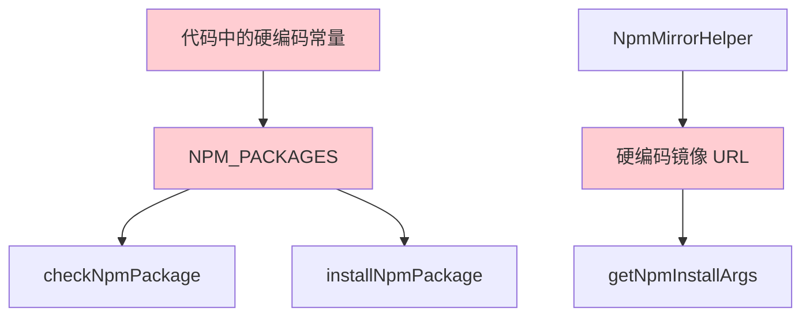
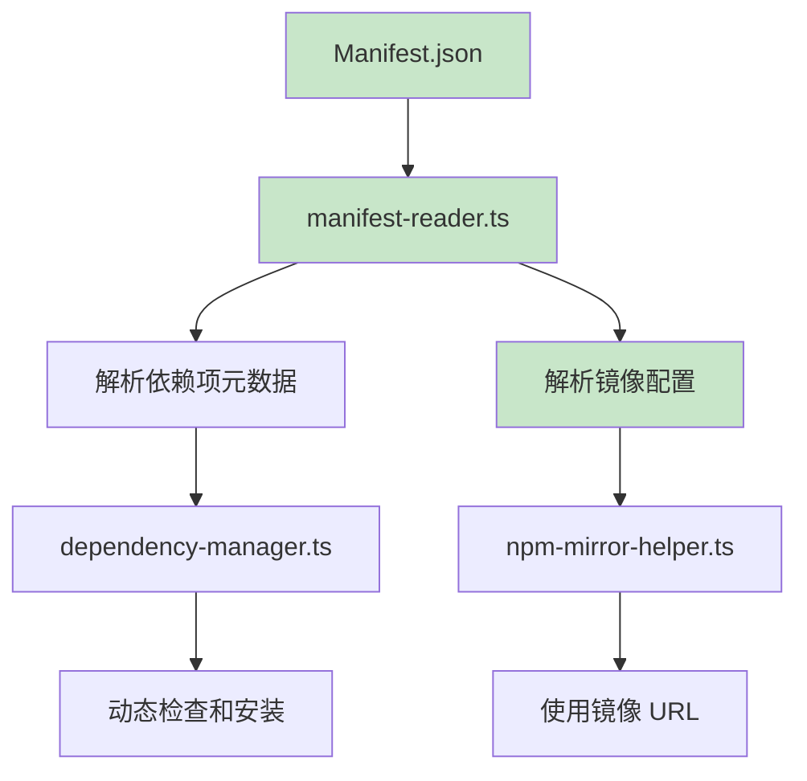
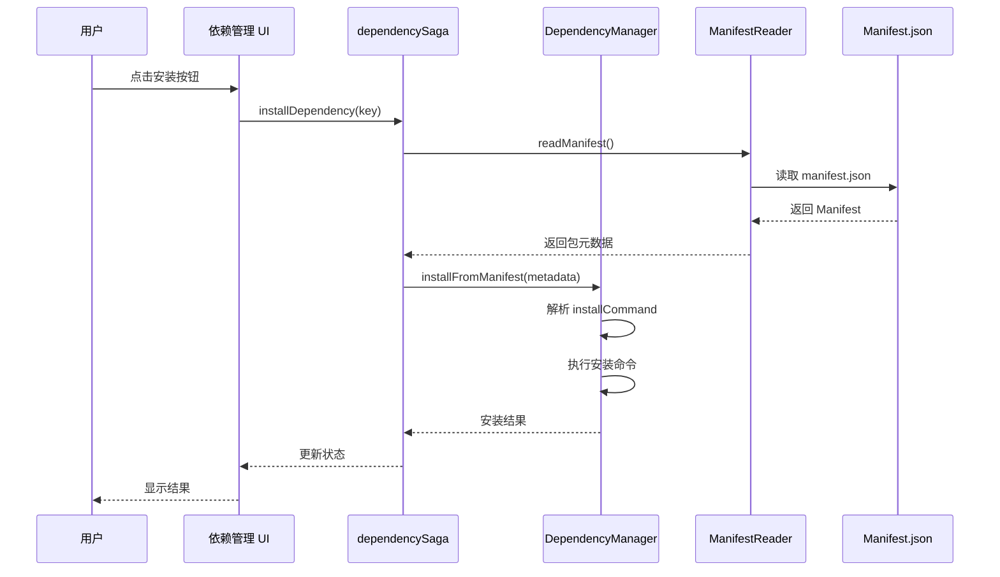

# Change: 将包元数据迁移至 Manifest

## Why

当前代码库中存在大量硬编码的依赖项适配代码，与 Manifest 文件中定义的包信息存在重复和冗余：

1. **维护负担**：包信息变更时需要同时修改 Manifest 和代码中的硬编码位置，容易出现数据不一致
2. **可扩展性限制**：新增依赖项需要修改多处代码，无法通过配置文件动态管理包元数据
3. **架构不一致**：项目已建立 Manifest 文件作为包信息的单一数据源，但代码中仍存在与 Manifest 功能重复的硬编码逻辑

硬编码内容包括：
- **Call Code 相关逻辑**：`claude_code` 包名、命令名、描述等
- **OpenSpec 相关配置**：`openspec` 包名、版本号等
- **Donate 捐赠链接和信息**：散落在各模块
- **NPM 包源和镜像配置**：`registry.npmmirror.com`、`registry.npmjs.org` 等

## What Changes

- **移除硬编码的包元数据**
  - 删除 `dependency-manager.ts` 中的 `NPM_PACKAGES` 常量定义
  - 移除硬编码的包描述信息和安装配置
  - 清理固定的包源 URL 和镜像地址

- **增强 Manifest 读取能力**
  - 扩展 `manifest-reader.ts` 以读取完整的包元数据
  - 支持从 Manifest 读取捐赠链接和信息
  - 支持 NPM 镜像配置的 Manifest 定义

- **重构依赖项适配逻辑**
  - 统一从 Manifest 读取包信息
  - 实现动态的包元数据加载机制
  - 建立统一的 Manifest Reader 接口

- **清理受影响的功能模块**
  - `web-service-manager.ts` 移除硬编码包信息
  - `npm-mirror-helper.ts` 从 Manifest 读取镜像配置
  - UI 组件移除硬编码内容

- **不保证向后兼容**（**BREAKING**）
  - 这是一个破坏性变更
  - 不保留对旧硬编码方式的兼容层
  - 一次性完成迁移

## Code Flow Changes

### 当前硬编码依赖数据流

### 迁移后 Manifest 驱动数据流

### 依赖项安装流程

## Impact

### Affected specs
- `specs/dependency-management/spec.md` - 修改为基于 Manifest 的依赖管理
- `specs/npm-mirror-config/spec.md` - 添加 Manifest 驱动的镜像配置
- `specs/package-management/spec.md` - 更新包元数据来源

### Affected code
- **主进程变更**：
  - `src/main/manifest-reader.ts` - 增强读取能力，支持完整元数据
  - `src/main/dependency-manager.ts` - 移除 `NPM_PACKAGES` 常量，从 Manifest 读取
  - `src/main/npm-mirror-helper.ts` - 从 Manifest 读取镜像配置
  - `src/main/web-service-manager.ts` - 清理硬编码包信息

- **渲染进程变更**：
  - `src/renderer/store/sagas/dependencySaga.ts` - 使用 Manifest 数据
  - `src/renderer/components/DependencyManagementCardUnified.tsx` - 移除硬编码
  - `src/renderer/store/slices/dependencySlice.ts` - 更新状态结构

### User impact

**正面影响**：
- 配置集中管理，易于维护和更新
- 支持通过更新 Manifest 文件动态添加新的依赖项
- 减少代码重复，降低维护成本

**潜在影响**：
- Manifest 文件损坏可能导致依赖管理功能失效
- 需要确保所有已安装版本都有有效的 Manifest 文件

### Risk assessment
- **高风险**：涉及核心依赖管理逻辑，需要全面测试
- **破坏性变更**：不保留向后兼容，需要同步更新 Manifest 结构
- **测试覆盖**：需要测试依赖项安装、检查、更新等完整流程

### Breaking changes
- **BREAKING**：移除所有硬编码的依赖项定义，依赖 Manifest 文件提供完整信息
- **BREAKING**：`NpmMirrorHelper` 的初始化方式变更，需要 Manifest 支持

### Migration notes
- 确保所有已安装版本都有有效的 `manifest.json` 文件
- 如需添加新的依赖项，只需更新 Manifest 文件，无需修改代码
- 镜像配置将优先从 Manifest 读取，fallback 到硬编码默认值
