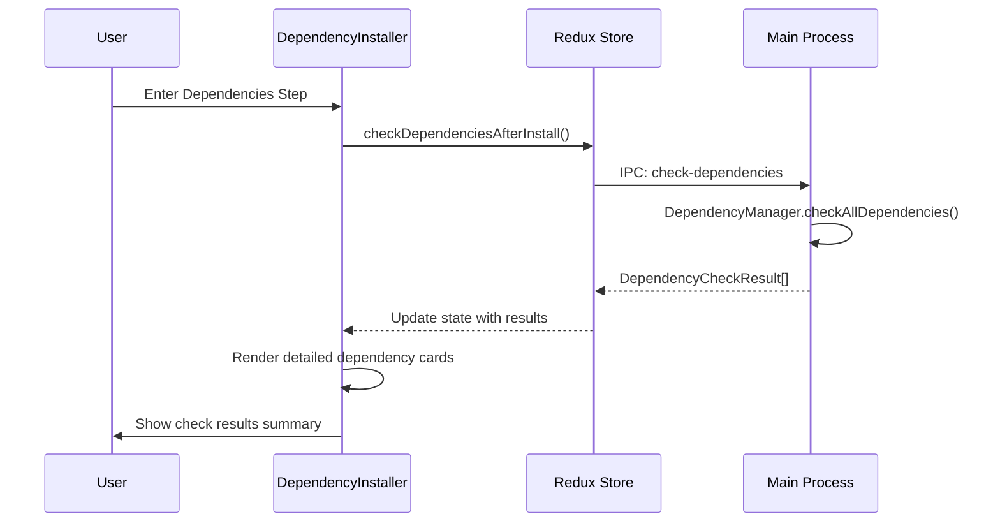

# 引导流程依赖检查结果详细展示

## 状态: ExecutionCompleted

## 概述

在首次使用引导流程的依赖检查步骤中，实现逐项依赖检查结果的详细展示，让用户清晰了解系统依赖的完整检查过程和结果。

## 问题陈述

### 用户体验问题

1. **信息透明度不足**：用户只能看到依赖检查的总体结果（通过/失败），无法了解具体检查了哪些依赖项
2. **缺乏教育价值**：新用户不清楚 Hagicode Server 运行需要哪些系统依赖
3. **排查困难**：当依赖检查失败时，用户无法快速定位具体缺失或损坏的依赖项
4. **可感知性低**：即使所有依赖检查成功，用户也无法感知系统进行了哪些验证工作

### 当前状态

引导流程使用 `DependencyInstaller` 组件（`src/renderer/components/onboarding/steps/DependencyInstaller.tsx`），该组件调用 `DependencyManagementCardUnified` 组件来显示依赖项。虽然 `DependencyManager.checkAllDependencies()` 已经返回了结构化的 `DependencyCheckResult[]`，但在引导流程中未充分利用这些详细信息来展示完整的检查结果。

## 解决方案

### 核心变更

#### 1. 主进程无需修改

`dependency-manager.ts` 已经返回完整的 `DependencyCheckResult[]`，包含以下信息：
- `name`: 依赖项名称
- `description`: 依赖项描述
- `type`: 依赖类型
- `installed`: 是否已安装
- `version`: 当前版本
- `requiredVersion`: 所需版本
- `versionMismatch`: 版本是否不匹配

#### 2. 渲染进程状态增强

在 `onboardingSlice.ts` 中添加新的状态字段来存储完整的依赖检查结果：

```typescript
interface OnboardingState {
  // ... 现有字段
  dependencyCheckResults: DependencyCheckResult[]; // 新增：存储完整的检查结果
}
```

#### 3. 引导步骤组件增强

修改 `DependencyInstaller` 组件，在现有基础上增加以下展示：

**整体进度指示器**
- 显示检查进度（检查中/已完成）
- 汇总信息：总依赖项数量、成功数量、失败数量

**依赖项详细列表**
- 每个依赖项以卡片形式展示
- 状态标识（✓ 已安装、⚠ 版本不匹配、✗ 未安装）
- 版本信息（当前版本/所需版本）
- 依赖项描述和用途

**可折叠详细信息**
- 支持展开/收起详细信息的交互
- 已安装的依赖项可以折叠以减少视觉干扰

#### 4. 国际化支持

在 `src/renderer/i18n/locales/en-US/onboarding.json` 和 `zh-CN/onboarding.json` 中添加：

```json
"dependencyCheck": {
  "title": "Dependency Check Results",
  "summary": "Checked {{total}} dependencies, {{passed}} passed, {{failed}} failed",
  "checking": "Checking dependencies...",
  "status": {
    "allPassed": "All dependencies are installed",
    "hasIssues": "Some dependencies need attention"
  },
  "details": {
    "expand": "Show details",
    "collapse": "Hide details"
  }
}
```

## UI 设计

### 组件布局

```
┌─────────────────────────────────────────────────────────┐
│           Package Icon                                   │
│   Installing System Dependencies                         │
│   Check the installation status of system dependencies  │
├─────────────────────────────────────────────────────────┤
│  Dependency Check Results                                │
│  ✓ Checked 3 dependencies, 2 passed, 1 needs attention    │
├─────────────────────────────────────────────────────────┤
│  ┌───────────────────────────────────────────────────┐  │
│  │ ✓ .NET 8.0 Runtime                    [Installed] │  │
│  │   Version: 8.0.11 / Required: 8.0+                │  │
│  │   Required for running Hagicode Server            │  │
│  └───────────────────────────────────────────────────┘  │
│  ┌───────────────────────────────────────────────────┐  │
│  │ ⚠ Node.js                             [Mismatch]  │  │
│  │   Version: 18.0.0 / Required: 20.0+              │  │
│  │   Required for package management                 │  │
│  │   [Upgrade]                                        │  │
│  └───────────────────────────────────────────────────┘  │
│  ┌───────────────────────────────────────────────────┐  │
│  │ ✗ Python 3.10+                        [Install]   │  │
│  │   Required for CLI tools                          │  │
│  └───────────────────────────────────────────────────┘  │
├─────────────────────────────────────────────────────────┤
│  [Install All Dependencies]                             │
└─────────────────────────────────────────────────────────┘
```

### 交互流程



## 影响分析

### 用户体验改进

1. **增强透明度**：用户清晰了解系统依赖的完整检查过程和结果
2. **提升信任感**：展示详细的验证工作，增强用户对应用可靠性的认知
3. **降低支持成本**：用户可自行定位和诊断依赖问题

### 技术影响

1. **向后兼容**：变更不影响现有依赖管理功能的核心逻辑
2. **性能影响**：依赖检查本身已存在，仅增加结果的结构化处理，性能影响可忽略
3. **代码变更范围**：
   - `src/renderer/store/slices/onboardingSlice.ts` - 添加状态字段
   - `src/renderer/components/onboarding/steps/DependencyInstaller.tsx` - UI 增强
   - `src/renderer/i18n/locales/*/onboarding.json` - 国际化文本

### 受影响的规范

- `openspec/specs/dependency-management/spec.md` - 需要添加引导流程展示需求

## 实施范围

### 主要变更

1. **状态管理**
   - `src/renderer/store/slices/onboardingSlice.ts` - 添加 `dependencyCheckResults` 状态

2. **UI 组件**
   - `src/renderer/components/onboarding/steps/DependencyInstaller.tsx` - 增强依赖检查结果展示

3. **国际化**
   - `src/renderer/i18n/locales/en-US/onboarding.json`
   - `src/renderer/i18n/locales/zh-CN/onboarding.json`

### 不包含在范围内

- 依赖检查逻辑本身的修改（复用现有实现）
- 依赖安装功能的修改
- 版本管理页面的依赖展示修改

## 风险评估

| 风险 | 影响 | 缓解措施 |
|------|------|----------|
| UI 信息过载 | 低 | 使用折叠/展开功能，默认显示摘要 |
| 状态同步延迟 | 低 | 使用现有 IPC 通道，无额外延迟 |
| 国际化覆盖不完整 | 低 | 优先实现中英文，后续扩展 |

## 成功标准

1. **功能完整性**
   - 在引导流程依赖步骤中显示所有依赖项的检查结果
   - 正确显示每个依赖项的状态、版本和描述信息
   - 汇总信息准确反映检查结果

2. **用户体验**
   - UI 清晰易读，不造成信息过载
   - 折叠/展开功能正常工作
   - 国际化文本正确显示

3. **代码质量**
   - 遵循项目现有的代码风格
   - 新增代码有适当的类型定义
   - 组件通过 ESLint 和 TypeScript 检查

## 后续工作

1. 收集用户反馈，迭代优化 UI
2. 考虑在版本管理页面应用类似的详细展示
3. 评估是否需要导出依赖检查报告功能
