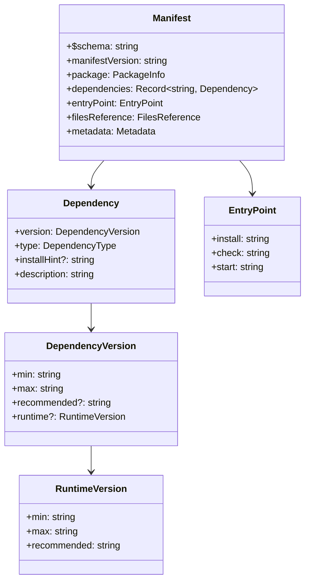
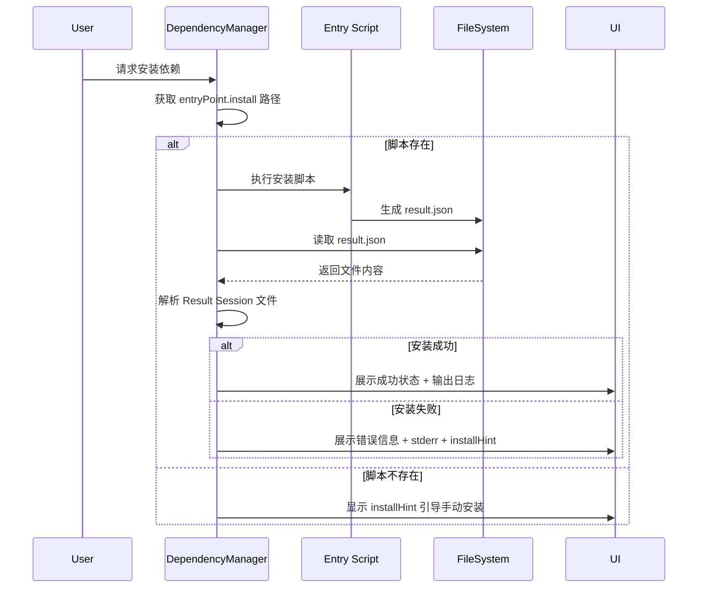

## Context

Hagicode Desktop 依赖管理模块需要适配最新的 manifest 文件格式规范（0.1.0-beta.4）。核心变更是将依赖检查和安装从内联命令执行改为脚本文件执行。

### 约束条件

- **不需要向后兼容**：直接替换旧逻辑，旧格式支持代码可删除
- **跨平台支持**：脚本路径需适配 Windows（`.bat`/`.ps1`）和 Unix（`.sh`）
- **工作目录**：entry point 脚本需在正确的安装目录下执行

### 涉及模块

- `manifest-reader.ts` - Manifest 解析和类型定义
- `dependency-manager.ts` - 依赖检查和安装执行
- `onboarding-manager.ts` - 首次引导流程中的依赖处理

## Goals / Non-Goals

### Goals

- 适配新的 manifest 格式，移除对 `installCommand` 和 `checkCommand` 的依赖
- 实现基于 `entryPoint` 的脚本执行机制
- 保持现有用户体验不变
- 确保跨平台脚本执行兼容性

### Non-Goals

- 不修改 UI 组件（DependencyCheckCard 等）
- 不修改 Redux store 结构
- 不添加向后兼容旧格式的支持

## Decisions

### Decision 1: EntryPoint 脚本执行策略

**选择**：在 manifest 中定义统一的 `entryPoint` 结构，包含 `install`、`check`、`start` 三个脚本路径。

**原因**：
- 统一入口点管理，便于维护
- 脚本文件可实现更复杂的逻辑（多命令、条件判断等）
- 便于包开发者自定义安装和检查逻辑

**替代方案**：
1. 保留内联命令 + 脚本混合模式 - 增加复杂度，不符合新规范
2. 完全移除自动安装，仅提供手动安装指引 - 降低用户体验

### Decision 2: 跨平台脚本处理

**选择**：根据 `process.platform` 自动选择正确的脚本扩展名。

```typescript
function getScriptPath(basePath: string, scriptName: string): string {
  if (process.platform === 'win32') {
    // 优先使用 .bat，其次是 .ps1
    const batPath = path.join(basePath, `${scriptName}.bat`);
    const ps1Path = path.join(basePath, `${scriptName}.ps1`);
    // 实际实现会检查文件存在性
    return batPath;
  }
  return path.join(basePath, `${scriptName}.sh`);
}
```

**原因**：
- 自动适配不同平台
- 减少配置复杂度

### Decision 3: installHint 处理

**选择**：当自动安装失败或不可用时，显示 `installHint` 作为手动安装指引。

**原因**：
- 提供用户友好的备选方案
- 符合新规范设计意图

### Decision 4: Result Session 文件解析与展示

**选择**：所有 entryPoint 脚本（install、check、start）执行后都会生成 `result.json` 文件，需要读取并解析该文件以获取执行结果。

**文件路径**：`{workingDirectory}/result.json`

**文件格式**：
```json
{
  "exitCode": 0,
  "stdout": "命令输出内容",
  "stderr": "错误输出内容",
  "duration": 1234,
  "timestamp": "2024-01-01T00:00:00.000Z",
  "success": true,
  "version": "10.0.0",
  "errorMessage": null
}
```

**类型定义**：
```typescript
interface ResultSessionFile {
  exitCode: number;           // 退出码，0 表示成功
  stdout: string;             // 标准输出
  stderr: string;             // 标准错误
  duration: number;           // 执行时长（毫秒）
  timestamp: string;          // 执行时间戳（ISO 8601）
  success: boolean;           // 执行是否成功
  version?: string;           // 检测到的版本号（check 脚本）
  errorMessage?: string;      // 错误信息
}
```

**适用的 entryPoint 脚本**：
- `entryPoint.check` - 依赖检查脚本
- `entryPoint.install` - 依赖安装脚本
- `entryPoint.start` - 服务启动脚本

**注意事项**：
- 当前 `start` 方法没有返回值，需要修改以返回启动结果
- 启动脚本应生成包含服务 URL 和端口的 result.json

**原因**：
- 通过文件传递结果，便于脚本实现复杂逻辑
- 标准化的 JSON 格式，易于解析和扩展
- 提供详细的执行反馈，便于用户了解安装/检查/启动进度
- 输出日志有助于调试脚本问题
- 统一三种操作的执行结果处理机制

**展示策略**：
- 成功时：显示简短成功消息 + 可选的详细日志查看
- 失败时：显示错误信息 + stderr 内容 + installHint
- 执行中：显示实时输出流（如支持）

## Technical Design

### 类型定义更新



### 核心方法签名变更

```typescript
// manifest-reader.ts
interface EntryPoint {
  install: string;   // 相对路径，如 "scripts/install.sh"
  check: string;     // 相对路径，如 "scripts/check.sh"
  start: string;     // 相对路径，如 "start.sh"
}

// dependency-manager.ts
class DependencyManager {
  // 新增：执行 entry point 脚本，生成 result.json 文件
  private async executeEntryPointScript(
    scriptPath: string,
    workingDirectory: string
  ): Promise<void>;

  // 新增：读取并解析 result.json 文件
  private async readResultFile(workingDirectory: string): Promise<ResultSessionFile>;

  // 新增：解析 Result Session 文件，提取关键信息
  private parseResultSession(result: ResultSessionFile): ParsedResult;

  // 修改：从 manifest 获取 entryPoint 并执行 check 脚本
  async checkFromManifest(dependencies: ParsedDependency[]): Promise<DependencyCheckResult[]>;

  // 修改：从 manifest 获取 entryPoint 并执行 install 脚本
  async installSingleDependency(dep: ParsedDependency): Promise<InstallResult>;
}

// web-service-manager.ts（或相关模块）
class WebServiceManager {
  // 修改：使用 entryPoint.start 启动服务，读取 result.json 获取结果
  // 注意：当前 start() 方法没有返回值，需要修改返回类型
  async start(): Promise<StartResult>;
}

// Result Session 文件格式（result.json）
interface ResultSessionFile {
  exitCode: number;
  stdout: string;
  stderr: string;
  duration: number;
  timestamp: string;          // ISO 8601 格式
  success: boolean;
  version?: string;           // check 脚本返回的版本号
  errorMessage?: string;
}

// 解析后的结果
interface ParsedResult {
  success: boolean;
  version?: string;           // 从 result.json 读取的版本号
  errorMessage?: string;      // 从 result.json 读取的错误信息
  rawOutput: string;          // 原始 stdout，用于展示
}

// 安装结果（包含 Result Session 信息）
interface InstallResult {
  success: boolean;
  resultSession: ResultSessionFile;
  parsedResult: ParsedResult;
  installHint?: string;       // 失败时的手动安装指引
}

// 启动结果（包含 Result Session 信息）
interface StartResult {
  success: boolean;
  resultSession: ResultSessionFile;
  parsedResult: ParsedResult;
  url?: string;               // 启动成功后的服务地址
  port?: number;              // 启动成功后的服务端口
}
```

### 错误处理流程



## Risks / Trade-offs

| 风险 | 影响 | 缓解措施 |
|-----|------|---------|
| 脚本执行权限问题 | 安装/检查失败 | 提前检查执行权限，提供 installHint 备选 |
| 跨平台脚本兼容性 | 部分平台不可用 | 为每个平台提供对应脚本（.sh/.bat/.ps1） |
| 工作目录错误 | 脚本找不到依赖 | 确保 `workingDirectory` 设置为安装路径 |
| 旧 manifest 不兼容 | 解析失败 | 明确版本要求，提供清晰错误信息 |
| Result Session 解析失败 | 无法展示执行详情 | 提供原始输出作为备选展示 |
| result.json 文件不存在 | 无法获取执行结果 | 显示通用错误 + installHint |
| start 方法返回值变更 | 影响现有调用方 | 需要同步更新所有调用方代码 |

## Migration Plan

1. **更新类型定义**：修改 `manifest-reader.ts` 中的接口定义
2. **定义 Result Session 接口**：新增 `ResultSessionFile`、`ParsedResult`、`InstallResult`、`StartResult` 类型
3. **重构依赖管理器**：实现 `executeEntryPointScript`、`readResultFile` 和 `parseResultSession` 方法
4. **更新检查逻辑**：`checkSingleDependency` 使用 entryPoint.check，读取并解析 result.json
5. **更新安装逻辑**：`installSingleDependency` 使用 entryPoint.install，读取并解析 result.json
6. **更新启动逻辑**：`start` 使用 entryPoint.start，读取并解析 result.json
7. **移除旧代码**：删除 `installCommand` 和 `checkCommand` 相关逻辑
8. **测试验证**：验证三种 entryPoint 脚本（check、install、start）的执行流程

### 回滚方案

如有问题，可通过 Git 回滚至变更前的 commit。变更不涉及数据迁移，回滚无数据风险。

## Open Questions

1. **脚本超时设置**：entry point 脚本执行的超时时间是否需要可配置？
   - 建议：保持现有 5 分钟超时设置

2. ~~**脚本输出处理**：是否需要捕获和显示脚本的 stdout/stderr？~~
   - ~~建议：是的，便于调试和用户反馈~~
   - **已解决**：通过 `result.json` 文件传递执行结果

3. **Result Session 展示粒度**：是否需要支持实时输出流展示？
   - 建议：初版实现完成后再考虑，先支持执行完成后的结果展示

4. **start 方法返回值处理**：当前 `start()` 方法没有返回值，如何平滑过渡？
   - 建议：直接修改返回类型为 `Promise<StartResult>`，同步更新所有调用方
