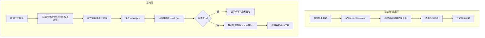
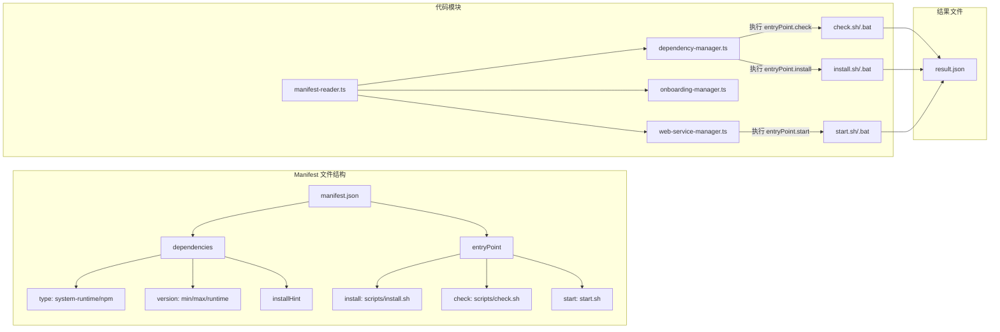

# Change: 依赖管理适配新 Manifest 格式

## Why

根据最新的 manifest 文件格式规范（版本 0.1.0-beta.4），依赖项管理机制发生了重大变更。现有的 `dependency-manager.ts` 和 `manifest-reader.ts` 依赖 `installCommand` 和 `checkCommand` 字段执行依赖检查和安装，但这些字段已被移除，改为通过 `entryPoint` 指定脚本文件执行。需要适配新的格式以保持依赖管理功能的正常运作。

## What Changes

### **BREAKING** - Manifest 类型定义变更

- 移除 `Dependency` 接口中的 `installCommand` 和 `checkCommand` 字段
- 新增 `EntryPoint` 接口定义脚本入口点
- 新增 `DependencyVersionWithRuntime` 中的 `runtime` 版本约束支持

### 依赖检查逻辑变更

- **旧模式**：执行内联命令（如 `dotnet --version`）
- **新模式**：执行 `entryPoint.check` 指定的脚本文件

### 依赖安装逻辑变更

- **旧模式**：执行内联命令（如 `winget install Microsoft.DotNet.Runtime.8`）
- **新模式**：执行 `entryPoint.install` 指定的脚本文件

### 数据结构扩展

- 新增 `type` 字段区分依赖类型：`system-runtime`、`npm`、`system-requirement`
- 版本约束采用嵌套结构，支持 `runtime` 子版本
- 新增 `installHint` 字段提供手动安装指引

### Result Session 文件解析与展示

- 所有 entryPoint 脚本（install、check、start）执行后会生成 `result.json` 文件
- 需要读取并解析 `result.json` 文件，提取执行状态、输出日志、错误信息等
- 将解析结果展示给用户，提供更好的执行反馈和调试信息

### 服务启动逻辑变更

- **旧模式**：直接执行启动命令或脚本，无返回值
- **新模式**：执行 `entryPoint.start` 指定的脚本文件，读取 result.json 获取启动结果（包含 URL 和端口）
- **影响**：`start()` 方法需要修改返回值类型，从无返回值改为返回 `StartResult`

## Code Flow Changes

### 依赖检查流程对比

### 依赖安装流程对比

### 架构变更图

## Impact

| 影响维度 | 说明 |
|---------|------|
| **受影响规范** | `dependency-management` |
| **受影响代码** | `src/main/manifest-reader.ts`, `src/main/dependency-manager.ts`, `src/main/onboarding-manager.ts`, `src/main/web-service-manager.ts` |
| **用户体验** | 无感知变化，功能保持一致 |
| **测试需求** | 需验证三种 entryPoint 脚本（check、install、start）的执行流程 |
| **文档更新** | 需更新类型定义说明 |
| **风险等级** | 中等 - 涉及核心依赖管理和启动模块 |

## Affected Files

| 文件路径 | 变更类型 | 变更原因 |
|---------|---------|---------|
| `src/main/manifest-reader.ts` | 修改 | 更新 Manifest 类型定义，新增 EntryPoint 解析 |
| `src/main/dependency-manager.ts` | 修改 | 重构依赖检查和安装逻辑，使用 entryPoint 脚本 |
| `src/main/onboarding-manager.ts` | 修改 | 适配新的依赖管理接口 |
| `src/main/web-service-manager.ts` | 修改 | 使用 entryPoint.start 启动服务，读取 result.json |
