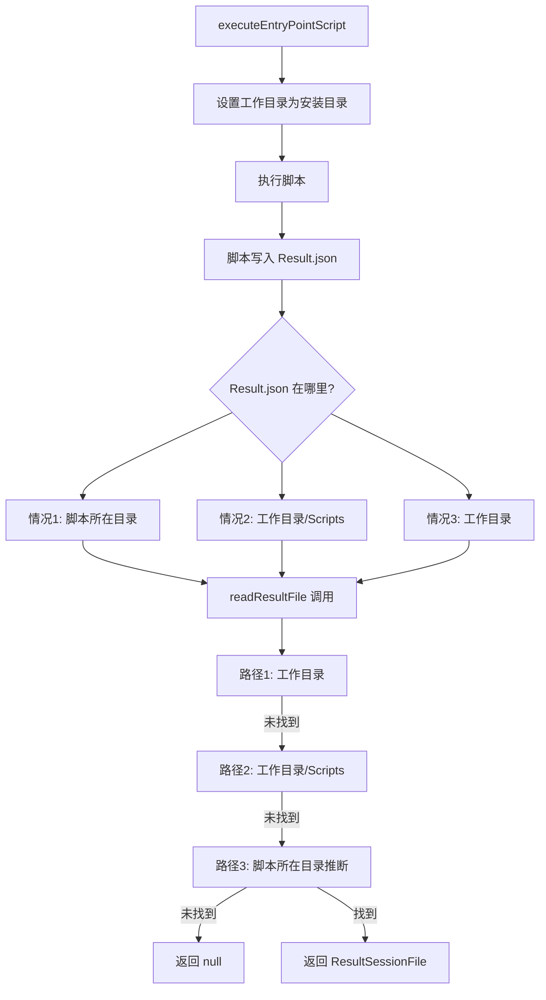

# Change: 修复依赖检查结果文件路径读取问题

## Why

EntryPoint 脚本执行时将 `Result.json` 文件写入脚本所在目录，而非项目安装目录（工作目录）下的 `Scripts` 文件夹。这导致 `DependencyManager.readResultFile()` 无法正确读取结果文件，进而导致依赖检查功能失败，所有依赖被错误标记为未安装状态。

## What Changes

- **MODIFIED** `DependencyManager.readResultFile()` 方法：增加多路径搜索策略
  - 首先在当前工作目录搜索
  - 如果未找到，在 `Scripts` 子目录中搜索
  - 如果仍未找到，在脚本所在目录搜索（通过脚本路径推断）
  - 保持向后兼容性

- **MODIFIED** `DependencyManager.executeEntryPointScript()` 方法：增强脚本执行路径日志
  - 添加更详细的日志输出，帮助诊断路径问题
  - 记录脚本路径、工作目录和结果文件搜索路径

## Code Flow Changes

## Impact

- Affected specs: `dependency-management`
- Affected code: `src/main/dependency-manager.ts:93-122` (readResultFile), `dependency-manager.ts:231-379` (executeEntryPointScript)
