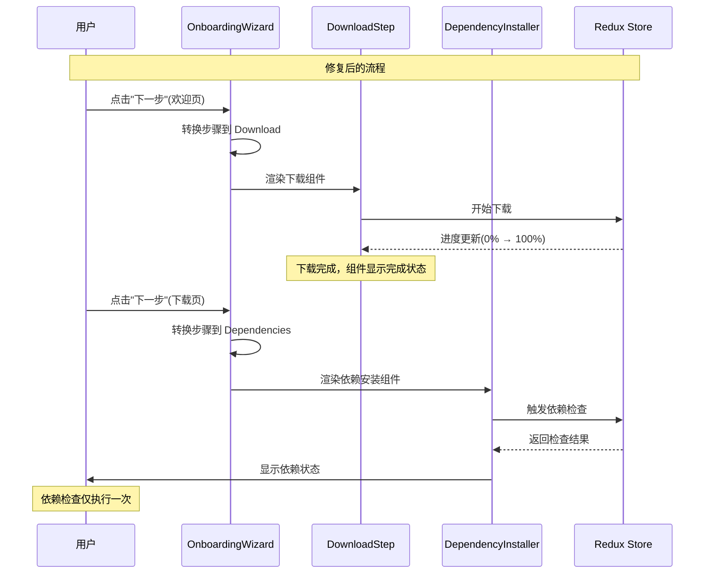
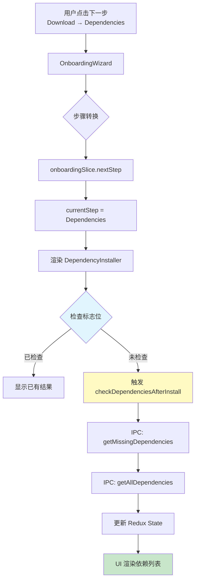

# Proposal: 修复首次引导流程中的重复依赖检查

## Summary

修复 Hagicode Desktop 应用首次使用引导流程中依赖检查重复执行的问题。当前实现在下载步骤完成后和用户进入依赖安装步骤时都会触发依赖检查，导致相同的检查操作执行两次，影响用户体验和系统性能。

## Problem

### 用户报告的问题

用户反馈在首次使用引导流程中存在令人困惑的重复检查现象：

1. **下载步骤完成后立即检查**：当软件包下载完成（进度达到 100%）时，系统立即执行依赖检查
2. **进入下一步时再次检查**：用户点击"下一步"按钮进入依赖安装步骤时，系统再次执行相同的依赖检查
3. **结果**：相同的依赖检查脚本执行两次，造成不必要的等待时间和系统资源消耗

### 根本原因分析

经过代码分析，重复检查的根本原因在于：

#### 1. 组件挂载触发检查（DependencyInstaller.tsx）

```typescript
// DependencyInstaller.tsx 第 58-64 行
useEffect(() => {
  if (downloadProgress?.version && dependencyCheckResults.length === 0) {
    console.log('[DependencyInstaller] Download complete, triggering initial dependency check for version:', downloadProgress.version);
    dispatch(checkDependenciesAfterInstall({ versionId: downloadProgress.version, context: 'onboarding' }));
  }
}, [downloadProgress?.version, dispatch]);
```

当 `DependencyInstaller` 组件挂载时，如果检测到下载已完成（`downloadProgress?.version` 存在）且没有依赖检查结果，就会触发依赖检查。

#### 2. 步骤转换时机问题

```typescript
// OnboardingWizard.tsx 第 87-96 行
const handleNext = () => {
  console.log('[OnboardingWizard] handleNext called, current step:', currentStep);
  dispatch(goToNextStep());

  // Trigger download when moving from Welcome to Download
  if (currentStep === OnboardingStep.Welcome && !isDownloading && !downloadCompleted) {
    console.log('[OnboardingWizard] Triggering download package');
    dispatch(downloadPackage());
  }
};
```

当用户在下载步骤（Download）点击"下一步"时，`goToNextStep` action 会立即将步骤转换为 Dependencies，导致 `DependencyInstaller` 组件挂载并触发检查。

#### 3. 下载完成时的检查机制

虽然 `downloadPackage` thunk 本身不会直接触发依赖检查，但下载完成后：
- IPC 事件将下载进度更新为 100%
- Redux 状态更新触发 `DependencyInstaller` 的 useEffect
- 如果此时用户仍在下载步骤（尚未点击"下一步"），但 `DependencyInstaller` 组件已经挂载，就会触发检查

### 影响范围

| 组件/模块 | 当前行为 | 影响 |
|-----------|---------|------|
| `DependencyInstaller.tsx` | 组件挂载时检查 | 导致首次检查 |
| `onboardingSlice.ts` | 步骤转换更新状态 | 触发组件挂载 |
| `OnboardingWizard.tsx` | 步骤转换逻辑 | 控制检查时机 |
| `dependencyThunks.ts` | `checkDependenciesAfterInstall` | 实际执行检查逻辑 |

## Solution

### 解决方案概述

采用**延迟检查策略**，仅在用户实际进入依赖安装步骤时执行依赖检查，移除组件挂载时的自动检查。

### 实施策略

#### 核心原则

1. **单一检查点**：依赖检查仅在用户主动进入依赖安装步骤时执行一次
2. **用户控制触发**：检查时机由用户操作（点击"下一步"）触发，而非组件生命周期
3. **最小化变更**：仅修改必要的触发逻辑，保持其他功能不变

### 实现方案

#### 方案选择

经过分析，采用以下修改：

| 方案 | 描述 | 优势 | 劣势 | 选择 |
|-----|------|------|------|------|
| A - 移除组件挂载检查 | 删除 `DependencyInstaller` 中挂载时的 useEffect | 简单直接，消除根源 | 需要确保其他场景不受影响 | ✅ 采用 |
| B - 添加检查状态标志 | 在 Redux 中添加 `hasChecked` 标志位 | 更精确控制 | 增加状态复杂度 | ❌ 不采用 |
| C - 条件渲染组件 | 仅在步骤已转换时渲染 `DependencyInstaller` | 从源头避免挂载 | 可能影响步骤切换动画 | ❌ 不采用 |

#### 代码变更详解

**修改文件**：`src/renderer/components/onboarding/steps/DependencyInstaller.tsx`

**变更内容**：移除或条件化组件挂载时的依赖检查 useEffect

```typescript
// 删除或修改以下 useEffect（第 58-64 行）
useEffect(() => {
  if (downloadProgress?.version && dependencyCheckResults.length === 0) {
    console.log('[DependencyInstaller] Download complete, triggering initial dependency check for version:', downloadProgress.version);
    dispatch(checkDependenciesAfterInstall({ versionId: downloadProgress.version, context: 'onboarding' }));
  }
}, [downloadProgress?.version, dispatch]);
```

**修改后**：

```typescript
// 仅在步骤已确认为 Dependencies 时检查
useEffect(() => {
  // 仅当组件在正确的步骤中挂载时才检查
  if (downloadProgress?.version && dependencyCheckResults.length === 0 && currentStep === OnboardingStep.Dependencies) {
    console.log('[DependencyInstaller] Dependencies step mounted, triggering dependency check for version:', downloadProgress.version);
    dispatch(checkDependenciesAfterInstall({ versionId: downloadProgress.version, context: 'onboarding' }));
  }
}, [downloadProgress?.version, dispatch, currentStep]);
```

**或者更简单的方案**：完全移除该 useEffect，依赖用户在依赖安装步骤中的其他交互触发检查。

### 用户交互流程



### 数据流程图



## Scope

### In Scope

| 任务 | 描述 | 优先级 |
|-----|------|-------|
| 修改 DependencyInstaller 组件 | 移除或条件化挂载时的依赖检查 | P0 |
| 验证步骤转换逻辑 | 确保下载完成后转换到依赖步骤正常工作 | P0 |
| 测试用户交互流程 | 验证从下载到依赖安装的完整流程 | P0 |
| 更新相关注释 | 更新代码注释说明检查触发逻辑 | P1 |

### Out of Scope

| 项目 | 原因 |
|-----|------|
| 修改主进程依赖检查逻辑 | 主进程逻辑正常，问题在渲染进程触发时机 |
| 修改依赖检查的具体实现 | 检查功能本身无需修改 |
| 修改步骤导航逻辑 | 当前导航逻辑符合预期 |
| 添加新功能或UI变更 | 此提案仅修复重复检查问题 |

## Impact

### User Impact

| 影响类型 | 描述 | 收益 |
|---------|------|------|
| 体验改善 | 消除令人困惑的重复检查 | 用户流程更顺畅 |
| 等待时间 | 减少一次完整的依赖检查 | 加快首次使用流程 |
| 系统响应 | 减少不必要的系统资源消耗 | 整体性能提升 |

### Technical Impact

| 影响类型 | 描述 | 风险等级 |
|---------|------|---------|
| Redux 状态管理 | 简化依赖检查触发逻辑 | 🟢 低 |
| 组件生命周期 | 移除自动挂载检查行为 | 🟢 低 |
| IPC 通信 | 减少一次重复的 IPC 调用 | 🟢 低 |
| 性能 | 减少脚本执行和进程启动 | 🟢 低 |

### 性能对比

| 指标 | 修复前 | 修复后 | 改善 |
|-----|--------|--------|------|
| 依赖检查次数 | 2次 | 1次 | -50% |
| IPC 调用次数 | 多次(3-4次) | 2次 | -33% |
| 用户等待时间 | 检查时间 × 2 | 检查时间 × 1 | -50% |

## Risk Assessment

**Risk Level: Low**

### 风险分析

| 风险 | 可能性 | 影响 | 缓解措施 |
|-----|--------|------|---------|
| 用户进入依赖步骤时未自动检查 | 🟡 中 | 🔴 高 | 添加测试用例验证 |
| 其他流程(版本管理)受影响 | 🟢 低 | 🟡 中 | 保持 context 参数区分 |
| 步骤导航出现异常 | 🟢 低 | 🟡 中 | 测试完整流程 |

### 回滚计划

如果修复导致问题，可以快速回滚：
1. 恢复 `DependencyInstaller.tsx` 中的原始 useEffect
2. 重新部署应用
3. 用户需接受重复检查的已知问题

## Dependencies

### 前置依赖

| 依赖项 | 状态 | 说明 |
|--------|------|------|
| Redux Store | ✅ 已存在 | dependencyCheckResults 状态 |
| IPC Handlers | ✅ 已存在 | 主进程依赖检查 API |
| Onboarding 流程 | ✅ 已存在 | 步骤导航逻辑 |

### 后续影响

无破坏性变更，不影响其他功能。

## Success Criteria

### 功能验收

- [ ] 下载步骤完成后，用户仍在下载页面时，不触发依赖检查
- [ ] 用户点击"下一步"进入依赖安装步骤时，触发一次依赖检查
- [ ] 依赖检查结果正确显示在 UI 中
- [ ] 用户可以正常安装缺失的依赖

### 性能验收

- [ ] 依赖检查在整个引导流程中仅执行一次
- [ ] 日志中仅显示一次 `checkDependenciesAfterInstall` 调用
- [ ] IPC 调用次数减少（可通过日志验证）

### 用户体验验收

- [ ] 用户不再看到重复的检查动画/进度
- [ ] 整体引导流程时间缩短
- [ ] 无错误或异常提示

## Related Issues

- 无关联 issue
- 可参考类似修复案例（如有）

## Alternatives Considered

### 替代方案 1：添加防重复标志

在 Redux state 中添加 `hasCheckedDependencies` 标志位：

```typescript
// onboardingSlice.ts
state.hasCheckedDependencies = false;
```

在触发检查前检查该标志，完成后设置为 true。

**为什么不采用**：
- 增加状态复杂度
- 需要管理标志位生命周期（何时重置）
- 当前问题可以通过移除不必要的行为直接解决

### 替代方案 2：主进程层面去重

在 `OnboardingManager.checkDependenciesStatus` 中添加防重复逻辑：

```typescript
// onboarding-manager.ts
private lastCheckedVersion: string | null = null;

async checkDependenciesStatus(versionId: string) {
  if (this.lastCheckedVersion === versionId) {
    return { success: true }; // 已检查过
  }
  this.lastCheckedVersion = versionId;
  // ... 执行检查
}
```

**为什么不采用**：
- 主进程逻辑正常，问题在渲染进程触发时机
- 增加主进程状态管理复杂度
- 版本切换场景可能导致标志位失效

### 替代方案 3：完全移除自动检查

不提供任何自动依赖检查，要求用户手动点击"检查依赖"按钮。

**为什么不采用**：
- 降低用户体验
- 违背引导流程的自动化设计
- 不符合产品预期
