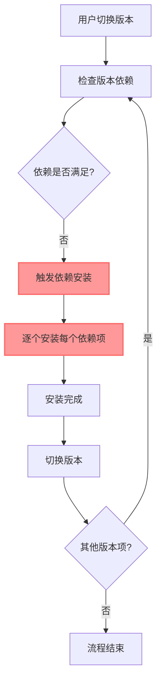
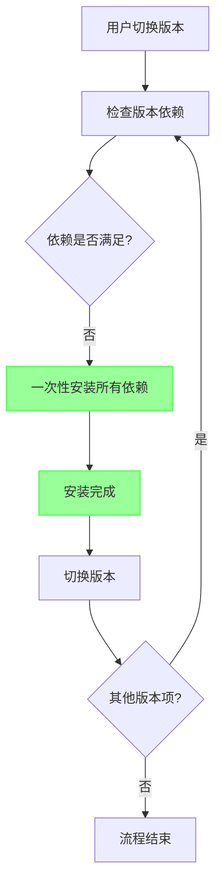
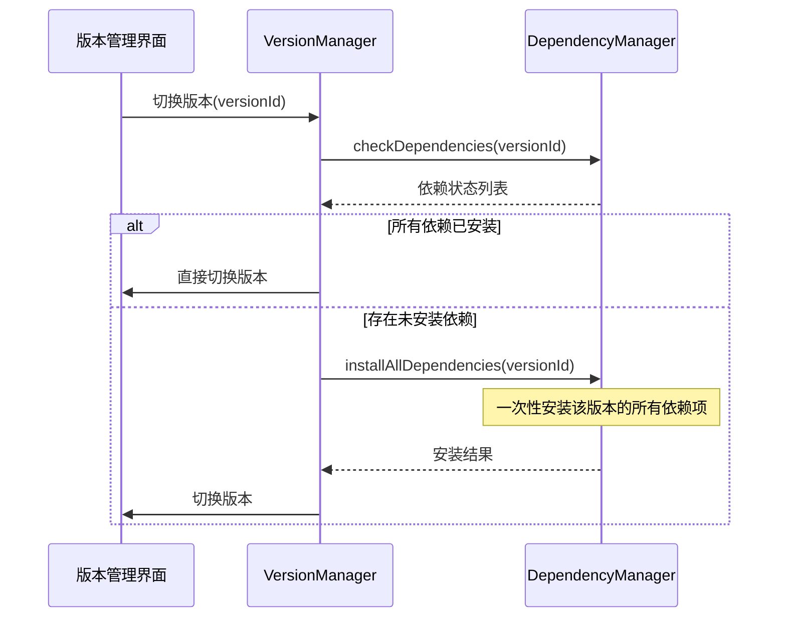
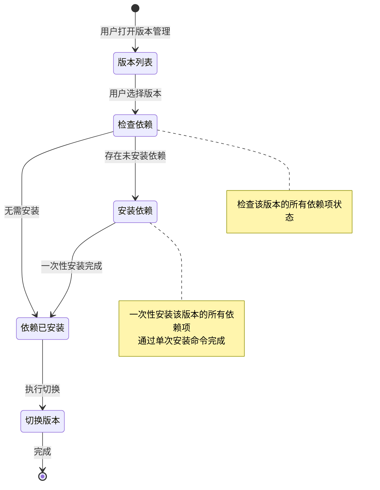

# Change: 优化版本管理模块依赖安装流程

## Why

当前 Hagicode Desktop 的版本管理模块中，依赖项安装逻辑存在不必要的重复执行问题。现有的安装脚本已经支持一次性安装所有依赖项，但版本管理模块可能对每个依赖项单独触发安装流程。

**核心问题**：
- **重复安装调用**：版本管理过程中可能对每个依赖项单独执行安装，导致重复的系统调用
- **效率低下**：一次性安装脚本未被充分利用，增加了不必要的系统调用和时间开销
- **用户体验**：用户可能看到多次重复的依赖安装提示和进度显示

**重要说明**：每个版本的依赖项应该通过单个安装命令一次性完成安装，而不是对每个依赖项单独触发安装流程。这是对现有安装能力的充分利用，而不是引入新的"全局依赖"概念。

## What Changes

- **统一依赖安装调用**：确保版本管理流程中对每个版本只触发一次依赖安装
- **一次性安装**：利用现有安装脚本的能力，通过单次调用安装该版本的所有依赖项
- **流程优化**：
  - 版本安装/切换前执行一次性依赖安装（如需要）
  - 确保单个版本项的所有依赖项通过一次安装命令完成
  - 避免对单个依赖项重复触发安装流程
- **保持兼容性**：不影响现有的依赖管理功能，保持向后兼容

## Code Flow Changes

### 当前流程（存在问题）



### 优化后流程



### 组件交互序列



## UI Design Changes

### 安装状态提示优化

当前状态（多次提示）：
```
┌──────────────────────────────────────────────────────────┐
│  正在切换到版本 v1.2.0...                          │
│  [████████░░] 80% - 正在安装依赖项                    │
│  - 正在安装 .NET Runtime...                             │
└──────────────────────────────────────────────────────────┘

（随后出现第二次提示）
┌──────────────────────────────────────────────────────────┐
│  正在切换到版本 v1.2.1...                          │
│  [████████░░] 80% - 正在安装依赖项                    │
│  - 正在安装 .NET Runtime...                             │
└──────────────────────────────────────────────────────────┘
```

优化后（统一提示）：
```
┌──────────────────────────────────────────────────────────┐
│  正在准备环境...                                      │
│  [████████████] 100% - 依赖项安装完成                  │
│  ✓ .NET Runtime 10.0.0                              │
│  ✓ Node.js 24.12.0                                   │
│  ✓ Claude Code 0.1.0-alpha.9                         │
│                                                          │
│  现在可以切换到任何版本                                 │
└──────────────────────────────────────────────────────────┘
```

### 版本切换流程界面



## Impact

### Affected specs
- **dependency-management** - 修改依赖安装流程，确保每个版本的所有依赖项通过一次安装命令完成

### Affected code

**Main Process**:
- `src/main/version-manager.ts:396-408` - 修改版本安装流程中的依赖检查逻辑，确保对每个版本只触发一次依赖安装
- `src/main/version-manager.ts:704-765` - 修改版本依赖检查方法，避免对单个依赖项重复触发安装
- `src/main/dependency-manager.ts:733-827` - 验证 `installFromManifest` 方法正确实现了一次性安装所有依赖项

**Renderer Process**:
- `src/renderer/pages/VersionManagementPage.tsx` - 更新版本切换 UI 逻辑，显示统一的安装进度

**IPC/Preload**:
- `src/preload/index.ts` - 可能需要更新依赖安装相关的 IPC 暴露

### Breaking changes
无破坏性变更。本次优化仅为内部流程优化，不影响对外 API 和用户界面。

### Migration requirements
无需数据迁移。本次变更仅优化内部流程，不涉及数据结构变更。

### Testing requirements

**单元测试**：
- 测试一次性依赖安装方法正确安装该版本的所有依赖项
- 测试依赖安装方法的幂等性（多次调用不会重复安装）

**集成测试**：
- 测试版本切换流程中对每个版本只触发一次依赖安装
- 测试安装完成后所有依赖项状态正确更新
- 测试依赖安装失败时的错误处理逻辑

**UI 测试**：
- 验证用户只看到一次依赖安装提示
- 验证安装进度显示的准确性
- 验证安装完成后的状态提示

### Performance considerations
- **减少系统调用**：通过一次性安装，避免对单个依赖项的重复安装调用
- **缩短版本切换时间**：依赖安装时间从多次调用缩短为单次调用
- **无额外内存开销**：不引入新的缓存机制，不增加内存占用

### Security considerations
- **权限验证**：依赖安装仍需用户确认，保持现有的安全验证机制
- **安装日志**：保持现有的安装日志记录，便于审计和故障排查

### Documentation updates
- 更新开发者文档，说明依赖安装流程的优化
- 更新用户手册，说明版本切换时的依赖安装行为
