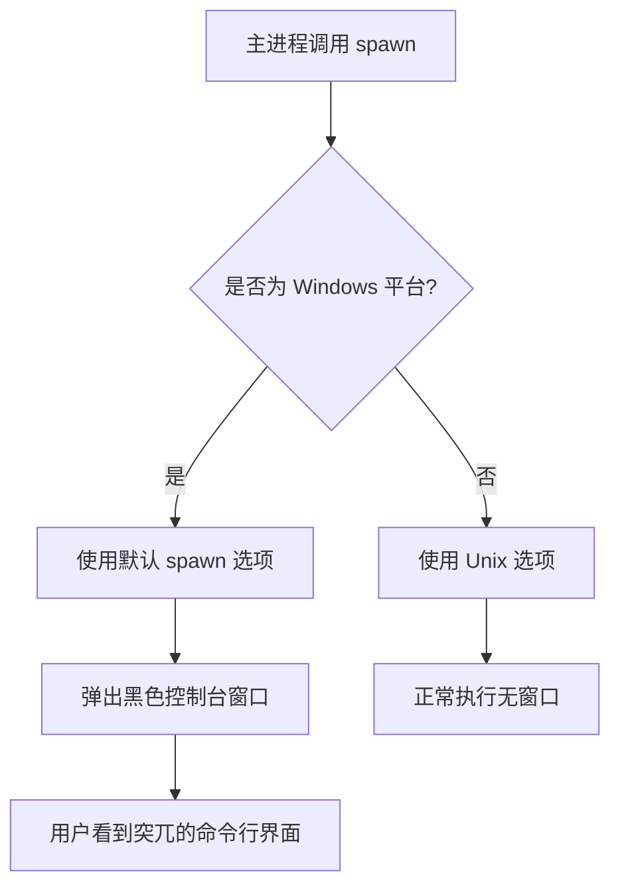
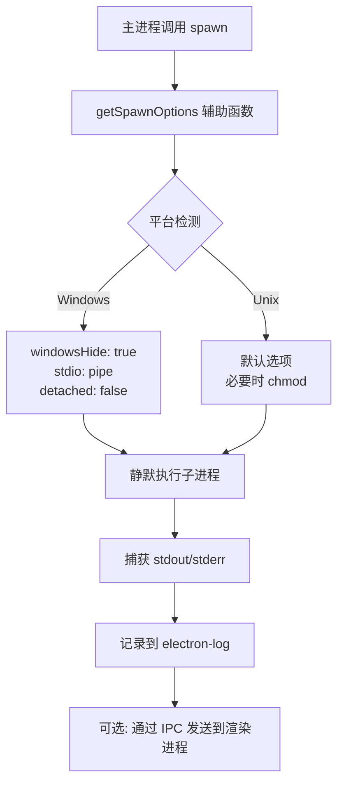
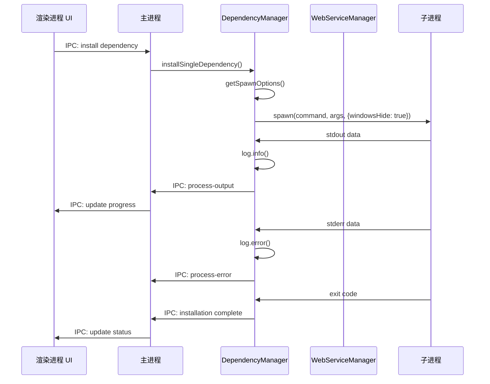

# Change: Windows 平台 BAT 脚本静默执行优化

## Why

在 Windows 平台上执行 BAT 脚本（如依赖安装、包安装）时会弹出黑色控制台窗口，这破坏了应用的现代化用户体验。用户期望安装过程在后台静默进行，通过应用界面查看进度，而非通过突兀的命令行窗口。

**核心问题**：
1. 用户体验问题：黑色控制台框的弹出显得突兀，不符合现代桌面应用标准
2. 静默安装需求：用户期望安装过程在后台进行，不需要看到命令行输出
3. 进程管理需求：应用希望通过 Stdio 自行管理子进程的重启和处理逻辑

## What Changes

### 核心变更

- **统一 spawn 选项配置**：创建辅助函数确保所有子进程调用使用正确的 Windows 特定选项
- **Stdio 流管理**：捕获并记录子进程的 stdout 和 stderr 到 electron-log
- **IPC 通信增强**：通过 IPC 将关键进程输出传递给渲染进程显示

### 技术实现

1. **子进程启动选项配置**
   - 使用 `child_process.spawn` 时配置 Windows 特定选项：
     - `windowsHide: true` - 隐藏控制台窗口
     - `shell: false` - 不通过 shell 执行，避免额外窗口
     - `stdio: ['pipe', 'pipe', 'pipe']` - 捕获标准输入/输出/错误

2. **Stdio 流管理**
   - 捕获子进程的 stdout 和 stderr
   - 将输出记录到 electron-log
   - 通过 IPC 将关键信息传递给渲染进程

3. **进程生命周期管理**
   - 维持现有的进程监控机制（PID、运行时间、重启次数）
   - 确保优雅关闭和强制终止功能正常工作
   - 进程退出时进行清理和状态更新

### 影响范围

**主要文件**：
- `src/main/dependency-manager.ts` - 依赖安装脚本执行
- `src/main/web-service-manager.ts` - Web 服务启动脚本执行

**次要影响**：
- `src/main/version-manager.ts` - 版本管理相关的脚本执行（如有）
- 可能涉及的其他 BAT 脚本调用场景

## 代码流程变更

### 当前实现问题

### 优化后流程

### 组件交互

### 代码变更清单

| 文件路径 | 变更类型 | 变更原因 | 影响范围 |
|---------|---------|---------|---------|
| `src/main/dependency-manager.ts` | 修改 | 统一 spawn 选项，添加 getSpawnOptions 辅助函数 | 依赖安装流程 |
| `src/main/web-service-manager.ts` | 修改 | 统一 spawn 选项，确保 windowsHide 应用 | Web 服务启动流程 |
| `src/main/version-manager.ts` | 检查 | 如有 spawn 调用，应用相同模式 | 版本管理流程 |

#### 详细变更 - dependency-manager.ts

| 方法/属性 | 变更类型 | 具体变更 | 变更原因 |
|----------|---------|---------|---------|
| getSpawnOptions (新增) | 新增方法 | 添加私有辅助方法返回平台特定 spawn 选项 | 统一选项配置，避免重复代码 |
| executeEntryPointScript | 修改 | 使用新的 getSpawnOptions() 方法获取选项 | 确保所有调用使用一致选项 |
| executeCommandWithRealTimeOutput | 修改 | 使用新的 getSpawnOptions() 方法获取选项 | 确保所有调用使用一致选项 |

#### 详细变更 - web-service-manager.ts

| 方法/属性 | 变更类型 | 具体变更 | 变更原因 |
|----------|---------|---------|---------|
| getSpawnOptions | 修改 | 添加 windowsHide: true 到 Windows 平台选项 | 隐藏控制台窗口 |
| getSpawnCommand | 检查 | 确保使用 getSpawnOptions() | 保持选项一致性 |

## Impact

### 用户体验改进

- **静默安装**：用户不再看到突兀的黑色控制台框
- **专业感提升**：符合现代桌面应用的 UX 标准
- **进度可见性**：通过应用 UI 显示安装进度，而非命令行输出

### 技术架构影响

- **代码改动点**：主要集中在主进程的子进程调用代码
- **新增模块**：可选的 process-manager.ts 统一管理子进程（如需进一步抽象）
- **IPC 变更**：可能需要新增通信通道传递进程输出
- **日志增强**：更完善的进程输出日志记录

### 兼容性验证

- 需在 Windows 10/11 上测试验证
- 确保 macOS 和 Linux 平台不受影响
- 验证现有安装流程的完整性

### 后续优化方向

- 考虑将所有平台的子进程管理统一到 process-manager.ts
- 支持更细粒度的安装进度反馈
- 支持安装过程的取消操作
